# 🎓 Student Record Management System

<p align="center">

  
  
  
  
  

</p>

<p align="center">
  <b>A feature-rich console-based Student Record Management System developed in C.</b>
</p>

<p align="center">
  Demonstrates structures, arrays, functions, loops, string handling, searching, sorting,
  validation, statistics, and file handling through an interactive menu-driven interface.
</p>

---

## 📌 Project Overview

The **Student Record Management System** is a complete console-based application developed in the **C programming language**.

The project is designed to manage student information efficiently through a simple and interactive menu-driven interface.

It allows users to:

- Add new student records
- Update existing student information
- Delete student records
- Search students by ID
- Display all students
- Calculate average marks
- Generate student statistics
- Sort student records
- Save data to a file
- Load saved data from a file
- Display top-performing students
- View students department-wise
- Update student marks independently
- Automatically calculate grades
- Validate age and marks
- Display formatted console output with colors

The project was developed as part of the **InternGrow C Programming Internship – Task 1: Student Record Management System**.

---

## ✨ Key Highlights

<table>
<tr>
<td width="50%">

### 🎯 Core Management

- Add Student
- Update Student
- Delete Student
- Search Student
- Display All Students

</td>

<td width="50%">

### 📊 Academic Analysis

- Average Marks
- Highest Marks
- Lowest Marks
- Grade Distribution
- Pass/Fail Statistics
- Top Performers

</td>
</tr>

<tr>
<td width="50%">

### 🔎 Data Operations

- Sort by ID
- Sort by Name
- Sort by Marks
- Sort by Age
- Department-wise View
- Update Marks

</td>

<td width="50%">

### 💾 Data Persistence

- Save records to file
- Load records from file
- Automatic save on exit
- Text-based data storage

</td>
</tr>
</table>

---

# 🖥️ Application Preview

## Main Menu

The application starts with a structured menu containing all available operations.

<p align="center">
  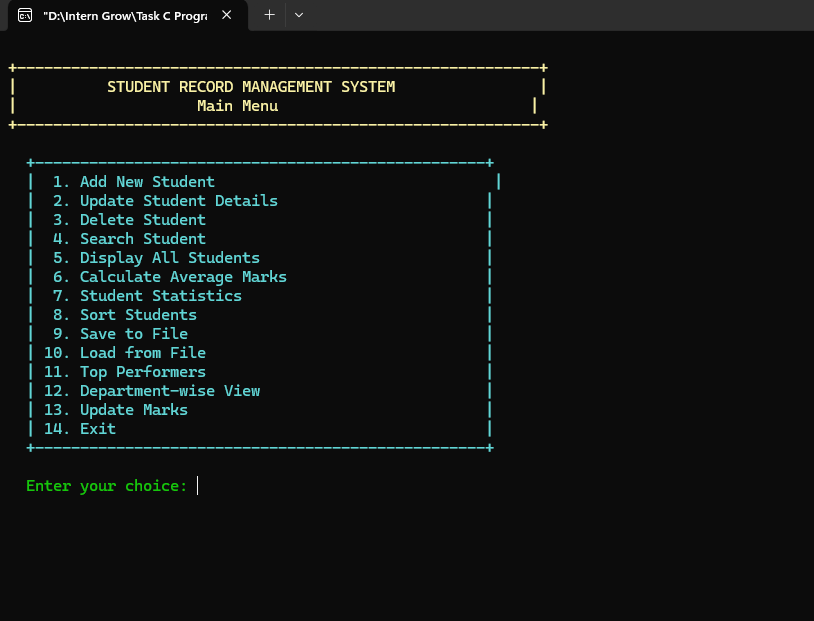
</p>

---

# 🚀 Features

## 1. Add New Student

The system allows the user to create a complete student record.

Each student record contains:

| Field | Description |
|---|---|
| Student ID | Unique numeric identifier |
| Name | Student's full name |
| Age | Student age |
| Marks | Marks between 0 and 100 |
| Grade | Automatically calculated |
| Department | Student department |
| Email | Student email |
| Phone | Student contact number |

The system also checks whether the entered Student ID already exists.

<p align="center">
  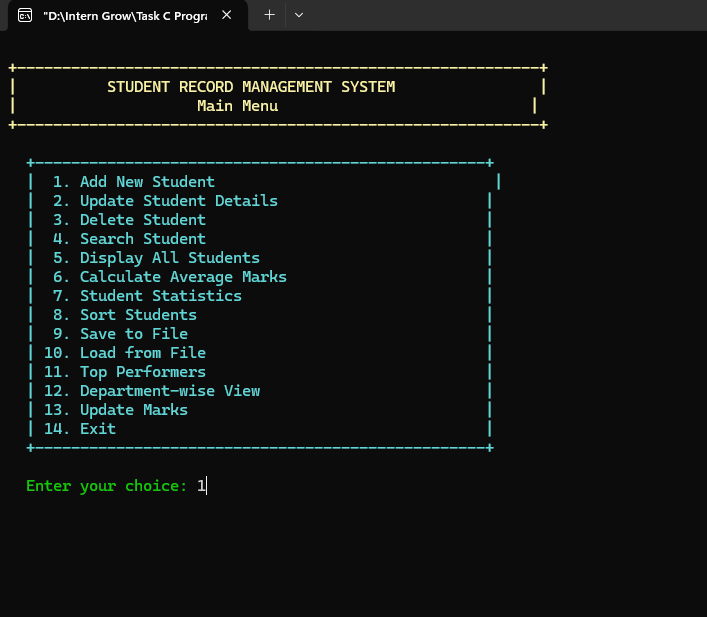
</p>

<p align="center">
  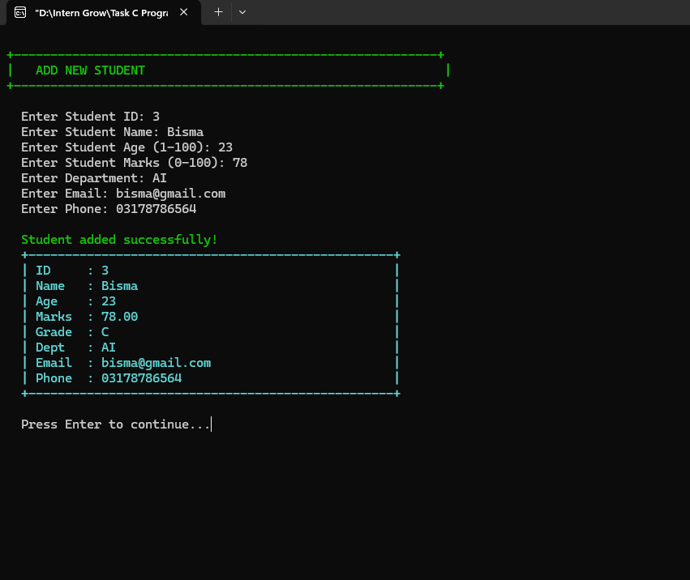
</p>

### Example

A student can be entered with:

```text
Student ID   : 3
Name         : Bisma
Age          : 23
Marks        : 78
Department   : AI
Email        : bisma@gmail.com
Phone        : 03178786564
````

The grade is automatically calculated from the marks.

---

# 2. Update Student Details

Existing student information can be updated using the student's ID.

The application displays the current record before asking for new information.

Users can update:

* Name
* Age
* Marks
* Department

Pressing **Enter** allows the user to keep the existing value.

<p align="center">
  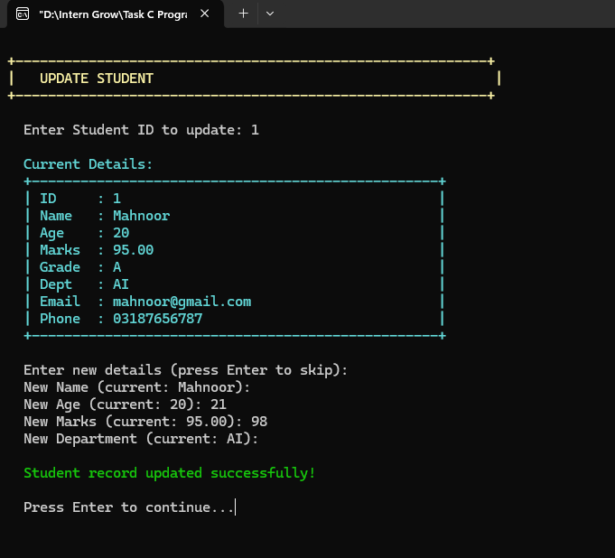
</p>

---

# 3. Delete Student

Students can be removed from the system using their unique Student ID.

Before deletion, the system displays the complete student record and asks for confirmation.

The deletion process can also be cancelled.

<p align="center">
  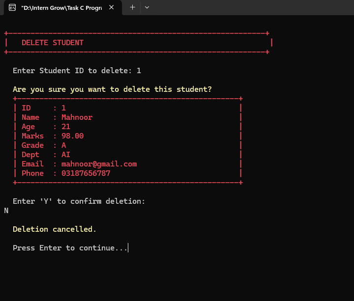
</p>

### Delete Workflow

```text
Enter Student ID
        ↓
Find Student
        ↓
Display Student Details
        ↓
Ask for Confirmation
        ↓
     ┌───────┐
     │   Y   │ → Delete Record
     └───────┘
        │
        └──── Other Input → Cancel Deletion
```

---

# 4. Search Student

Students can be searched using their unique Student ID.

If the record exists, the complete student information is displayed.

<p align="center">
  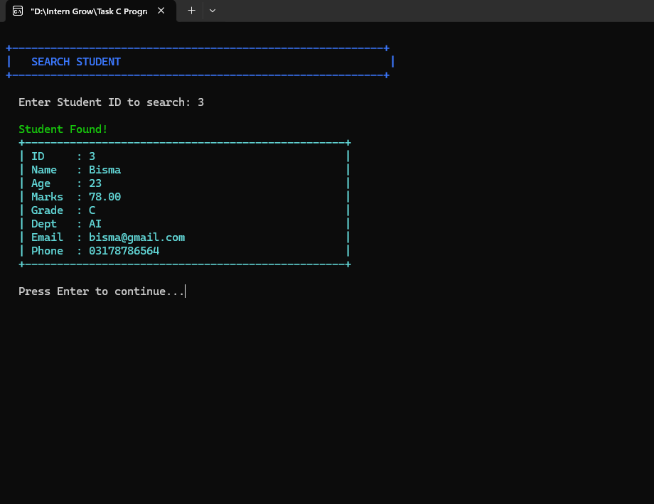
</p>

### Search Result Includes

* ID
* Name
* Age
* Marks
* Grade
* Department
* Email
* Phone

---

# 5. Display All Students

The application displays all stored students in a structured table.

<p align="center">
  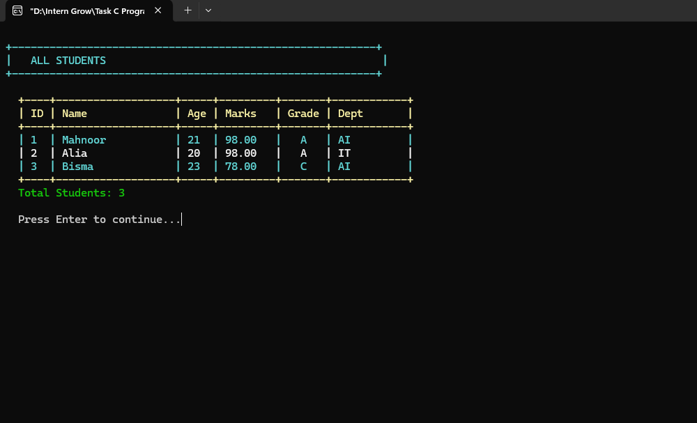
</p>

The table displays:

```text
ID
Name
Age
Marks
Grade
Department
```

The total number of students is also displayed.

---

# 6. Calculate Average Marks

The application calculates academic performance statistics from all student records.

<p align="center">
  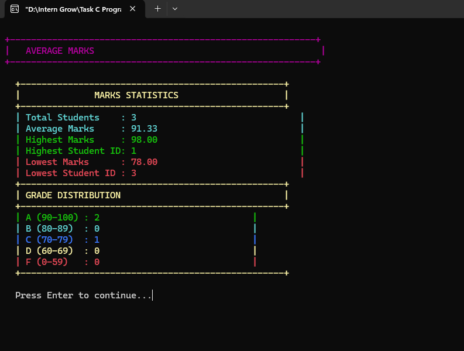
</p>

### Calculated Information

* Total Students
* Average Marks
* Highest Marks
* Highest Student ID
* Lowest Marks
* Lowest Student ID
* Grade Distribution

### Grade System

|    Marks | Grade |
| -------: | :---: |
| 90 – 100 |   A   |
|  80 – 89 |   B   |
|  70 – 79 |   C   |
|  60 – 69 |   D   |
|   0 – 59 |   F   |

The grade is automatically recalculated whenever marks are changed.

---

# 7. Student Statistics

The application also provides general student statistics.

<p align="center">
  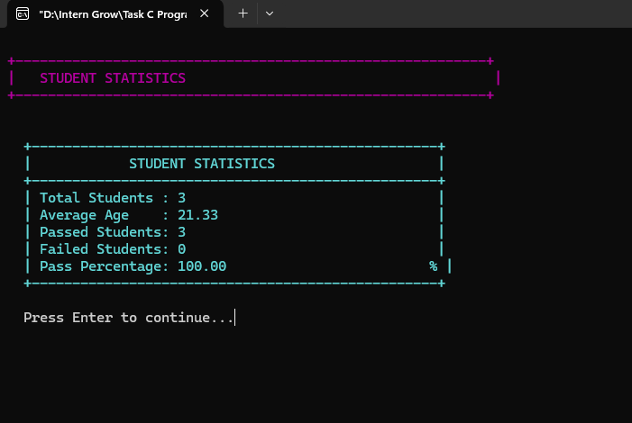
</p>

### Statistics Include

* Total Students
* Average Age
* Passed Students
* Failed Students
* Pass Percentage

This provides a quick overview of the student dataset.

---

# 8. Sort Students

Student records can be sorted using multiple criteria.

<p align="center">
  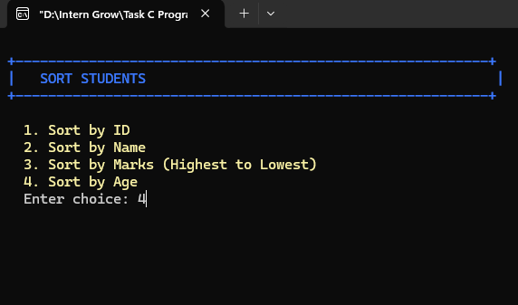
</p>

### Available Sorting Options

```text
1. Sort by ID
2. Sort by Name
3. Sort by Marks (Highest to Lowest)
4. Sort by Age
```

The program uses comparison and swapping logic to rearrange records inside the student array.

---

## Sorted Student Records

Example of the resulting sorted student list:

<p align="center">
  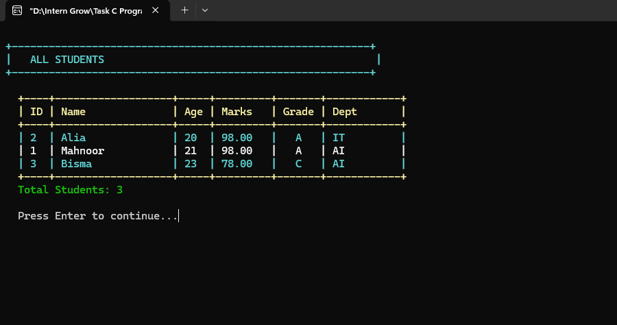
</p>

---

# 9. Save Student Data to File

The application supports persistent data storage using a text file.

<p align="center">
  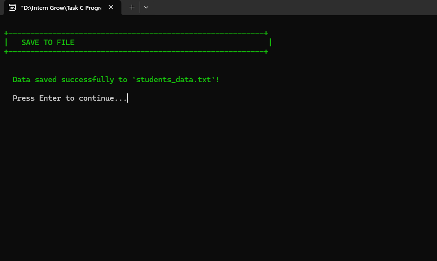
</p>

Student records are stored in:

```text
students_data.txt
```

The saved information includes:

* Student ID
* Name
* Age
* Marks
* Department
* Email
* Phone

The grade is recalculated when records are loaded.

---

# 10. Load Student Data from File

Previously saved student records can be loaded back into the application.

<p align="center">
  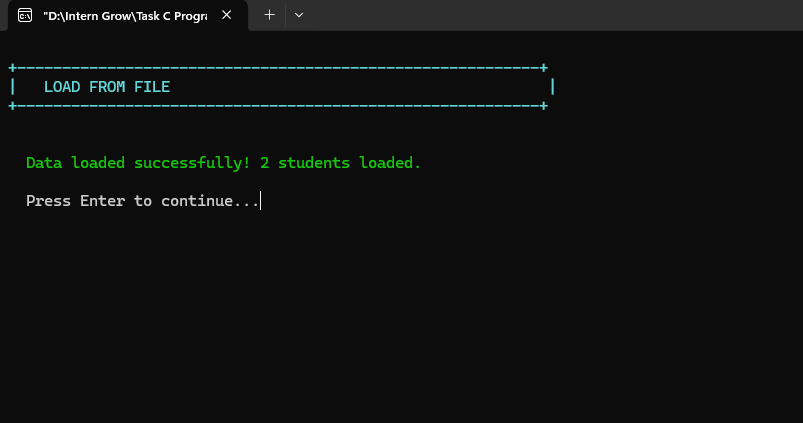
</p>

The program reads the saved records and reconstructs the student data in memory.

### File Persistence Workflow

```text
Student Records
      ↓
 Save to File
      ↓
students_data.txt
      ↓
Load from File
      ↓
Student Records Restored
```

---

# 11. Top Performers

The system identifies the highest-performing students based on marks.

<p align="center">
  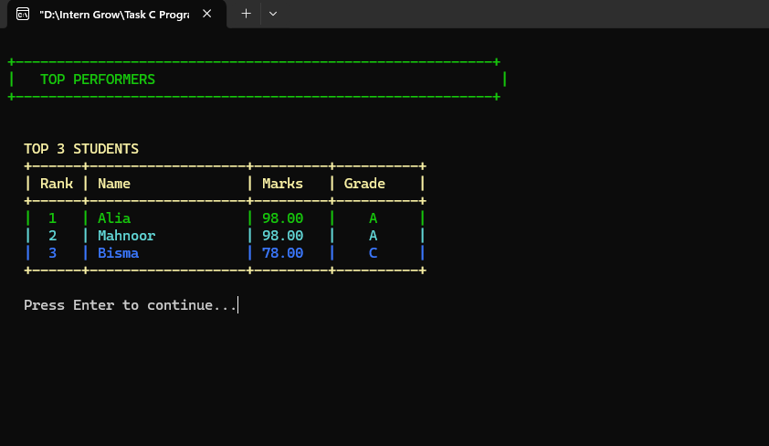
</p>

The application displays up to the **Top 5 Students**.

The ranking includes:

| Rank | Information    |
| ---: | -------------- |
|    1 | Highest marks  |
|    2 | Second highest |
|    3 | Third highest  |
|    4 | Fourth highest |
|    5 | Fifth highest  |

If fewer than five students exist, the program displays all available students.

---

# 12. Department-Wise View

Student records can be grouped and displayed according to their department.

<p align="center">
  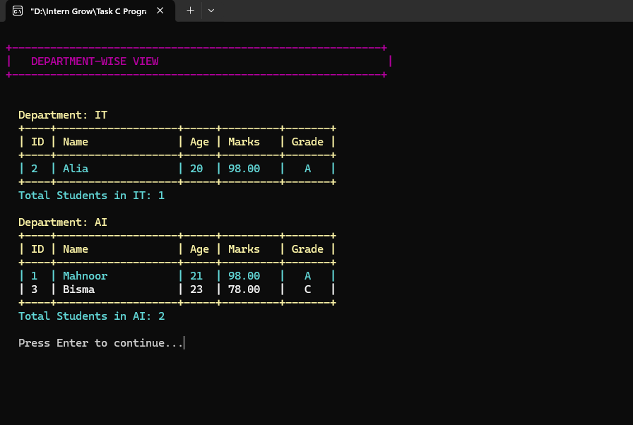
</p>

The department-wise view displays:

* Department Name
* Student ID
* Student Name
* Age
* Marks
* Grade
* Number of students in each department

This provides a simple way to analyze student distribution across departments.

---

# 13. Update Marks

Marks can be updated independently without changing the rest of the student's record.

<p align="center">
  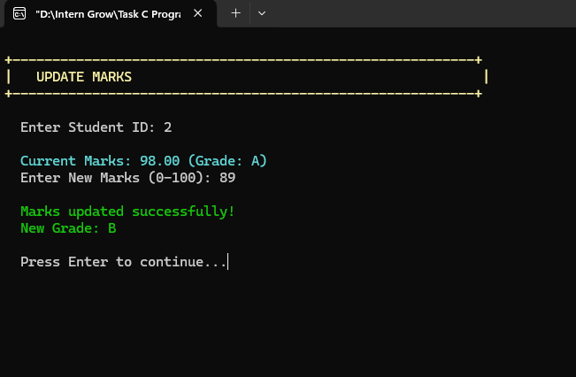
</p>

When marks are updated:

```text
Old Marks
    ↓
Enter New Marks
    ↓
Validate 0–100
    ↓
Update Marks
    ↓
Recalculate Grade
```

For example:

```text
Current Marks : 98.00
New Marks     : 89

New Grade     : B
```

---

# 14. Save Confirmation

The application confirms successful data persistence.

<p align="center">
  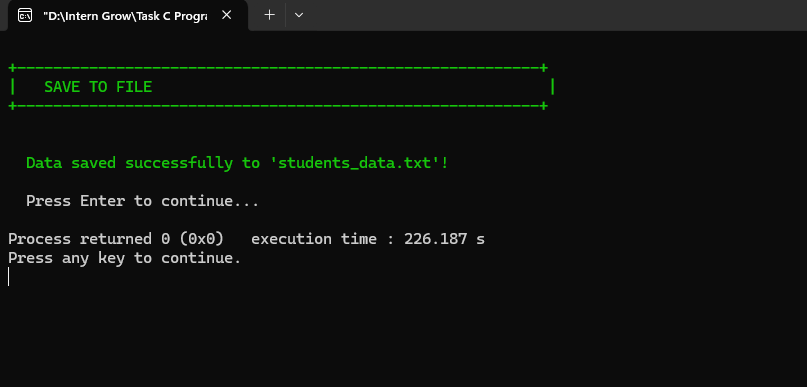
</p>

The program confirms that the student records have been successfully written to:

```text
students_data.txt
```

---

# 🧠 Concepts Demonstrated

This project combines the fundamental C programming concepts covered during the internship.

<table>
<tr>
<th>Concept</th>
<th>Implementation</th>
</tr>

<tr>
<td>Variables</td>
<td>Student data, counters, statistics and temporary values</td>
</tr>

<tr>
<td>Arrays</td>
<td>Storage of up to 100 student records</td>
</tr>

<tr>
<td>Structures</td>
<td>Student records containing multiple data fields</td>
</tr>

<tr>
<td>Functions</td>
<td>Separate functions for each system operation</td>
</tr>

<tr>
<td>Loops</td>
<td>Searching, sorting, displaying and calculating statistics</td>
</tr>

<tr>
<td>Conditional Statements</td>
<td>Validation, grading, searching and menu control</td>
</tr>

<tr>
<td>String Handling</td>
<td>Name, department, email and phone processing</td>
</tr>

<tr>
<td>File Handling</td>
<td>Saving and loading student records</td>
</tr>

<tr>
<td>Searching</td>
<td>Student lookup by ID</td>
</tr>

<tr>
<td>Sorting</td>
<td>ID, name, marks and age sorting</td>
</tr>

<tr>
<td>Input Validation</td>
<td>Age and marks range validation</td>
</tr>

<tr>
<td>Console Formatting</td>
<td>Colored and structured Windows console interface</td>
</tr>

</table>

---

# 🏗️ Program Architecture

The application follows a function-based structure.

```text
main()
 │
 ├── loadFromFile()
 │
 └── displayMenu()
       │
       ├── addStudent()
       ├── updateStudent()
       ├── deleteStudent()
       ├── searchStudent()
       ├── displayAllStudents()
       ├── calculateAverageMarks()
       ├── displayStudentStatistics()
       ├── sortStudents()
       ├── saveToFile()
       ├── loadFromFile()
       ├── displayTopPerformers()
       ├── displayDepartmentWise()
       └── updateMarks()
```

Supporting functions include:

```text
setColor()
displayHeader()
printLine()
clearInputBuffer()
isValidAge()
isValidMarks()
findStudentById()
calculateGrade()
displayStudentDetails()
countFails()
```

---

# 🗂️ Project Structure

```text
Task 1 Student Record Management System/
│
├── main.c
│
├── README.md
│
└── images/
    │
    ├── .gitkeep
    ├── 01_Main_Menu.png
    ├── 02_Add_Student_Menu_Selection.png
    ├── 03_Add_New_Student.png
    ├── 04_Update_Student.png
    ├── 05_Delete_Student_Cancelled.png
    ├── 06_Search_Student.png
    ├── 07_Display_All_Students.png
    ├── 08_Average_Marks_Statistics.png
    ├── 09_Student_Statistics.png
    ├── 10_Sort_Students_Menu.png
    ├── 11_Sorted_Students_By_Age.png
    ├── 12_Save_To_File.png
    ├── 13_Load_From_File.png
    ├── 14_Top_Performers.png
    ├── 15_Department_Wise_View.png
    ├── 16_Update_Marks.png
    └── 17_Save_To_File_Confirmation.png
```

---

# 📄 Student Data Structure

The application stores student information using a C structure.

```c
struct Student {
    int id;
    char name[MAX_NAME_LENGTH];
    int age;
    float marks;
    char grade;
    char department[30];
    char email[50];
    char phone[15];
};
```

A fixed-size array is used to store student records:

```c
struct Student students[MAX_STUDENTS];
```

The application supports up to:

```text
100 Students
```

---

# 🔐 Validation & Data Integrity

The application includes several validation mechanisms.

## Student ID

Duplicate Student IDs are rejected.

```text
Error: Student with ID already exists!
```

## Age Validation

Age must be within:

```text
1 – 100
```

## Marks Validation

Marks must be within:

```text
0 – 100
```

Invalid marks are rejected.

## Delete Confirmation

Deletion requires explicit confirmation:

```text
Enter 'Y' to confirm deletion:
```

Any other input cancels the deletion.

## Student Search

The system checks whether the requested Student ID exists before performing update, delete, search, or marks-update operations.

---

# 🎨 Console Interface

The application uses Windows console color attributes to visually distinguish different types of information.

### Color Usage

```text
Green    → Success messages
Red      → Errors / warnings
Yellow   → Headers / important information
Blue     → Search / sorting sections
Cyan     → Student information
Magenta  → Statistics / department views
White    → General output
```

The interface also uses structured borders and tables to make the console application easier to read.

---

# 💾 File Handling

The system uses standard C file handling functions:

```c
fopen()
fprintf()
fscanf()
fgets()
fclose()
```

The data file is:

```text
students_data.txt
```

### Save Operation

```text
Application Memory
       ↓
students[]
       ↓
fprintf()
       ↓
students_data.txt
```

### Load Operation

```text
students_data.txt
       ↓
fscanf() / fgets()
       ↓
students[]
       ↓
Application
```

---

# 📊 Grade Calculation Logic

Grades are automatically assigned according to marks.

```text
90 – 100  → A
80 – 89   → B
70 – 79   → C
60 – 69   → D
0 – 59    → F
```

The grade is recalculated when:

* A new student is added
* Student marks are updated
* Student details are updated
* Records are loaded from the file

---

# 🔄 Complete Application Workflow

```text
                    ┌───────────────────┐
                    │      START        │
                    └─────────┬─────────┘
                              │
                              ▼
                    ┌───────────────────┐
                    │ Load Saved Data   │
                    └─────────┬─────────┘
                              │
                              ▼
                    ┌───────────────────┐
                    │    Main Menu      │
                    └─────────┬─────────┘
                              │
          ┌───────────────────┼───────────────────┐
          │                   │                   │
          ▼                   ▼                   ▼
     Add / Update         Search / Delete     Analysis
          │                   │                   │
          ▼                   ▼                   ▼
      Student Data        Student Records      Statistics
          │                   │                   │
          └───────────────────┼───────────────────┘
                              │
                              ▼
                    ┌───────────────────┐
                    │ Save / Load File  │
                    └─────────┬─────────┘
                              │
                              ▼
                    ┌───────────────────┐
                    │       Exit        │
                    └───────────────────┘
```

---

# 🛠️ Technologies Used

| Technology         | Purpose                               |
| ------------------ | ------------------------------------- |
| C                  | Core programming language             |
| C Standard Library | Input, strings, files and utilities   |
| `stdio.h`          | Input/output and file handling        |
| `string.h`         | String manipulation                   |
| `stdlib.h`         | Utility functions and program control |
| `windows.h`        | Windows console color formatting      |
| Text File          | Persistent student data storage       |

---

# 💻 Requirements

## Operating System

Windows is recommended because the application uses:

```c
#include <windows.h>
```

for console color formatting.

## Compiler / IDE

The project can be compiled using:

* Code::Blocks with MinGW
* Dev-C++
* MinGW GCC
* Visual Studio Code with GCC/MinGW configured

---

# ▶️ How to Run

## Option 1 — Code::Blocks

1. Open Code::Blocks.
2. Create or open a C project.
3. Add `main.c`.
4. Build the project.
5. Run the application.

---

## Option 2 — GCC / MinGW

Open Command Prompt or terminal in the project directory.

Compile:

```bash
gcc main.c -o StudentRecordManagement.exe
```

Run:

```bash
StudentRecordManagement.exe
```

---

# 📁 Data File

After saving records, the program creates:

```text
students_data.txt
```

Keep this file in the same working directory as the executable if you want the application to load previously saved records.

---

# 📸 Complete Feature Gallery

## Main Interface

<table>
<tr>
<td align="center" width="50%">

<br><b>01 — Main Menu</b>
</td>

<td align="center" width="50%">

<br><b>02 — Add Student Selection</b>
</td>
</tr>
</table>

---

## Student Management

<table>
<tr>
<td align="center" width="50%">

<br><b>03 — Add New Student</b>
</td>

<td align="center" width="50%">

<br><b>04 — Update Student</b>
</td>
</tr>

<tr>
<td align="center" width="50%">

<br><b>05 — Delete Student / Cancellation</b>
</td>

<td align="center" width="50%">

<br><b>06 — Search Student</b>
</td>
</tr>

<tr>
<td align="center" width="50%">

<br><b>07 — Display All Students</b>
</td>

<td align="center" width="50%">

<br><b>16 — Update Marks</b>
</td>
</tr>
</table>

---

## Analytics & Statistics

<table>
<tr>
<td align="center" width="50%">

<br><b>08 — Average Marks Statistics</b>
</td>

<td align="center" width="50%">

<br><b>09 — Student Statistics</b>
</td>
</tr>

<tr>
<td align="center" width="50%">

<br><b>14 — Top Performers</b>
</td>

<td align="center" width="50%">

<br><b>15 — Department-Wise View</b>
</td>
</tr>
</table>

---

## Sorting

<table>
<tr>
<td align="center" width="50%">

<br><b>10 — Sort Students Menu</b>
</td>

<td align="center" width="50%">

<br><b>11 — Sorted Student Records</b>
</td>
</tr>
</table>

---

## File Persistence

<table>
<tr>
<td align="center" width="50%">

<br><b>12 — Save to File</b>
</td>

<td align="center" width="50%">

<br><b>13 — Load From File</b>
</td>
</tr>

<tr>
<td align="center" width="50%">

<br><b>17 — Save Confirmation</b>
</td>

<td align="center">
</td>
</tr>
</table>

---

# 📋 Main Menu Reference

The current application provides the following operations:

```text
1.  Add New Student
2.  Update Student Details
3.  Delete Student
4.  Search Student
5.  Display All Students
6.  Calculate Average Marks
7.  Student Statistics
8.  Sort Students
9.  Save to File
10. Load from File
11. Top Performers
12. Department-wise View
13. Update Marks
14. Exit
```

---

# 🧩 Function Reference

| Function                     | Purpose                                |
| ---------------------------- | -------------------------------------- |
| `main()`                     | Starts and controls the application    |
| `displayMenu()`              | Displays the main menu                 |
| `addStudent()`               | Adds a new student                     |
| `updateStudent()`            | Updates student details                |
| `deleteStudent()`            | Deletes a student                      |
| `searchStudent()`            | Searches for a student                 |
| `displayAllStudents()`       | Displays all records                   |
| `calculateAverageMarks()`    | Calculates marks statistics            |
| `displayStudentStatistics()` | Displays overall student statistics    |
| `sortStudents()`             | Sorts records using different criteria |
| `saveToFile()`               | Saves records to `students_data.txt`   |
| `loadFromFile()`             | Loads records from the data file       |
| `displayTopPerformers()`     | Displays top 5 students                |
| `displayDepartmentWise()`    | Groups students by department          |
| `updateMarks()`              | Updates marks and recalculates grade   |
| `findStudentById()`          | Searches internal array by ID          |
| `calculateGrade()`           | Calculates A–F grade                   |
| `isValidAge()`               | Validates age range                    |
| `isValidMarks()`             | Validates marks range                  |
| `countFails()`               | Counts failed students                 |
| `displayStudentDetails()`    | Displays complete student information  |
| `clearInputBuffer()`         | Clears leftover input characters       |
| `setColor()`                 | Changes Windows console text color     |
| `displayHeader()`            | Displays formatted section headers     |
| `printLine()`                | Prints formatted separator lines       |

---

# 📈 Complexity Overview

The project uses array-based data storage and comparison-based searching/sorting.

| Operation            | Typical Complexity |
| -------------------- | -----------------: |
| Add Student          |               O(1) |
| Search by ID         |               O(n) |
| Delete Student       |               O(n) |
| Display All Students |               O(n) |
| Average Calculation  |               O(n) |
| Statistics           |               O(n) |
| Sort by ID           |              O(n²) |
| Sort by Name         |              O(n²) |
| Sort by Marks        |              O(n²) |
| Sort by Age          |              O(n²) |
| Top Performers       |              O(n²) |
| Department-wise View |              O(n²) |

Here, `n` represents the number of stored students.

---

# 🎯 Learning Outcomes

Through this project, the following C programming concepts were practiced and integrated into one complete application:

* Structure-based data modeling
* Array-based record management
* Function-based program organization
* Menu-driven programming
* Conditional statements
* Iterative loops
* String manipulation
* Searching algorithms
* Sorting algorithms
* File input/output
* Data validation
* Statistical calculations
* Record deletion and array shifting
* Automatic grade calculation
* Console UI formatting
* Persistent data storage

---

# 🌟 Why This Project Matters

This project goes beyond a basic CRUD program by combining multiple C programming concepts into one practical application.

Instead of demonstrating individual concepts separately, the system integrates them into a single workflow:

```text
Data Structures
      +
Functions
      +
Searching
      +
Sorting
      +
Validation
      +
Statistics
      +
File Handling
      +
Console UI
      =
Complete C Application
```

It demonstrates the ability to translate programming fundamentals into a practical record-management system.

---

# 🔮 Possible Future Enhancements

The current version focuses on core C programming concepts. Possible future improvements include:

* Multi-file architecture using `.c` and `.h` files
* Login and role-based access
* Advanced input validation
* Automatic Student ID generation
* Binary file storage
* Backup and restore functionality
* CSV export
* Report generation
* Attendance management
* Course management
* Fee management
* GPA calculation
* More advanced search filters
* Dashboard-style statistics
* Cross-platform console support

---

# 🏆 Project Status

```text
████████████████████████████████████████ 100%

Project Status: Completed
```

The implemented version includes:

* [x] Student CRUD operations
* [x] Search functionality
* [x] Student listing
* [x] Marks calculation
* [x] Grade calculation
* [x] Student statistics
* [x] Sorting
* [x] File saving
* [x] File loading
* [x] Top performers
* [x] Department-wise records
* [x] Marks updating
* [x] Input validation
* [x] Console formatting
* [x] Screenshot documentation

---

# 👩‍💻 Developer

### Mahnoor Yasir

**BS Computer Science | C Programming Internship**

Developed as part of the **InternGrow Internship Program**.

---

# 📌 Internship Task

**Task 1 — Student Record Management System**

### Scenario

Develop a console-based Student Record Management System using C.

### Required Concepts

```text
Variables
Loops
Functions
Arrays
Structures
```

### Implemented Upgrades

```text
Menu-Driven Interface
Input Validation
Modular Functions
File Handling
Searching
Sorting
Statistics
```

---

# 📚 Project Summary

The **Student Record Management System** is a C-based console application that provides a complete solution for managing student records.

It combines:

```text
Student Management
        +
Academic Analysis
        +
Sorting & Searching
        +
Statistics
        +
File Persistence
        +
Interactive Console UI
```

The result is a practical demonstration of core C programming skills through a structured and functional application.

---

<p align="center">

### ⭐ Student Record Management System

<b>Built with C • Developed for InternGrow C Programming Internship</b>

</p>

<p align="center">
  <i>Learning by building practical software.</i>
</p>
