# 🏦 Advanced Banking Management System

<p align="center">
  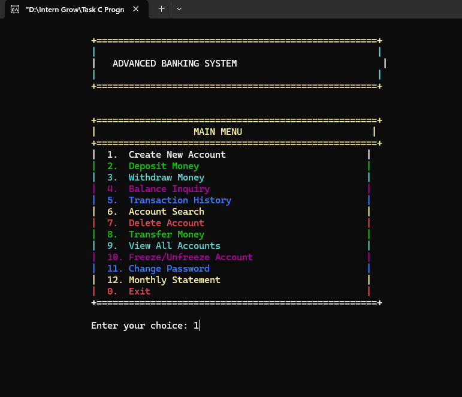
</p>

<h1 align="center">Advanced Banking Management System</h1>

<p align="center">
  A feature-rich, menu-driven banking application developed in C
</p>

<p align="center">
  
  
  
  
</p>

---

## 📌 Project Overview

The **Advanced Banking Management System** is a console-based banking application developed in the **C programming language**.

The project demonstrates the practical implementation of core C programming concepts including:

- Structures
- Nested structures
- Functions
- Arrays
- File handling
- Binary file storage
- Conditional logic
- Loops
- String manipulation
- Input validation
- Password protection
- Transaction management
- Date and time handling
- Error handling
- Windows console formatting

The system provides a complete set of banking operations through a structured command-line interface.

Users can create accounts, deposit money, withdraw money, check balances, view transaction history, search accounts, transfer funds, change passwords, generate monthly statements, and manage account status.

Account data is persistently stored in a binary file named:

```text
accounts.dat
````

This allows account information and transaction records to remain available even after the program is closed.

---

# ✨ Project Highlights

<table>
<tr>
<td width="50%" valign="top">

### 👤 Account Management

* Create new account
* Search account
* View all accounts
* Delete account
* Change password
* Freeze / unfreeze account

</td>

<td width="50%" valign="top">

### 💰 Banking Operations

* Deposit money
* Withdraw money
* Transfer money
* Balance inquiry
* Transaction history
* Monthly statements

</td>
</tr>

<tr>
<td width="50%" valign="top">

### 🔐 Security

* Password-protected transactions
* Masked password input
* Admin authentication
* Frozen-account protection
* Password confirmation
* Operation validation

</td>

<td width="50%" valign="top">

### 💾 Data Management

* Binary file storage
* Automatic loading
* Automatic saving
* Persistent account records
* Transaction records
* Date and time tracking

</td>
</tr>
</table>

---

# 🎯 Objectives

The main objectives of this project are to demonstrate how C programming concepts can be combined to create a practical banking application.

### Primary Objectives

1. Implement banking operations using C structures.
2. Store account information using structured data.
3. Maintain transaction history for every account.
4. Persist account data using binary file handling.
5. Implement password-protected banking operations.
6. Validate user input and prevent invalid transactions.
7. Implement account status management.
8. Provide a user-friendly console interface.
9. Generate transaction and monthly account reports.
10. Demonstrate modular programming through functions.

---

# 🧰 Technologies & Tools

| Technology   | Purpose                                    |
| ------------ | ------------------------------------------ |
| C            | Core programming language                  |
| `stdio.h`    | Input/output and file operations           |
| `stdlib.h`   | Memory, random numbers and program control |
| `string.h`   | String manipulation                        |
| `time.h`     | Date and time handling                     |
| `ctype.h`    | Character validation                       |
| `conio.h`    | Password masking and keyboard input        |
| `windows.h`  | Windows console colors                     |
| Binary Files | Persistent account storage                 |

---

# 🏗️ System Architecture

```text
                  ┌─────────────────────────────┐
                  │     ADVANCED BANKING        │
                  │          SYSTEM             │
                  └──────────────┬──────────────┘
                                 │
                                 ▼
                  ┌─────────────────────────────┐
                  │         MAIN MENU           │
                  └──────────────┬──────────────┘
                                 │
          ┌──────────────────────┼──────────────────────┐
          │                      │                      │
          ▼                      ▼                      ▼
   ACCOUNT MANAGEMENT     BANKING OPERATIONS      REPORTING
          │                      │                      │
          ├─ Create              ├─ Deposit             ├─ History
          ├─ Search              ├─ Withdraw            └─ Statement
          ├─ Delete              ├─ Transfer
          ├─ Password            └─ Balance
          └─ Freeze
                                 │
                                 ▼
                      ┌─────────────────────┐
                      │   TRANSACTION DATA  │
                      └──────────┬──────────┘
                                 │
                                 ▼
                      ┌─────────────────────┐
                      │    accounts.dat     │
                      │   Binary Storage    │
                      └─────────────────────┘
```

---

# 📊 Main Menu

The application provides the following main menu:

```text
+====================================================+
|                  MAIN MENU                         |
+====================================================+
|  1.  Create New Account                            |
|  2.  Deposit Money                                 |
|  3.  Withdraw Money                                |
|  4.  Balance Inquiry                               |
|  5.  Transaction History                           |
|  6.  Account Search                                |
|  7.  Delete Account                                |
|  8.  Transfer Money                                |
|  9.  View All Accounts                             |
|  10. Freeze/Unfreeze Account                       |
|  11. Change Password                               |
|  12. Monthly Statement                             |
|  0.  Exit                                          |
+====================================================+
```

The main menu is implemented using a `while` loop and a `switch` statement.

The program continues running until the user selects:

```text
0. Exit
```

---

# 📸 Main Menu

<table>
<tr>
<td align="center">

### 01 — Main Menu


<br>

The main dashboard provides access to all account and banking operations.

</td>
</tr>
</table>

---

# 🧱 Data Structures

The application uses two main structures:

1. `Transaction`
2. `Account`

These structures allow the system to represent real-world banking data in an organized way.

---

## 📜 Transaction Structure

```c
typedef struct {
    char type[20];
    float amount;
    float balance_after;
    char date[30];
    char description[50];
} Transaction;
```

### Transaction Fields

| Field           | Description                        |
| --------------- | ---------------------------------- |
| `type`          | Type of transaction                |
| `amount`        | Transaction amount                 |
| `balance_after` | Account balance after transaction  |
| `date`          | Transaction date and time          |
| `description`   | Additional transaction information |

Examples of transaction types include:

```text
Account Created
Deposit
Withdrawal
Transfer Sent
Transfer Received
```

---

## 👤 Account Structure

```c
typedef struct {
    int account_no;
    char name[50];
    char password[20];
    float balance;
    Transaction transactions[200];
    int transaction_count;
    char creation_date[30];
    char account_type[15];
    float daily_withdrawal_limit;
    float daily_withdrawn;
    char last_withdrawal_date[30];
    int is_active;
} Account;
```

### Account Fields

| Field                    | Description                             |
| ------------------------ | --------------------------------------- |
| `account_no`             | Unique account number                   |
| `name`                   | Account holder name                     |
| `password`               | Account password                        |
| `balance`                | Current account balance                 |
| `transactions`           | Array containing transaction records    |
| `transaction_count`      | Number of transactions                  |
| `creation_date`          | Date and time account was created       |
| `account_type`           | Savings or Current                      |
| `daily_withdrawal_limit` | Maximum daily withdrawal                |
| `daily_withdrawn`        | Amount withdrawn during the current day |
| `last_withdrawal_date`   | Date of the last withdrawal             |
| `is_active`              | Account status: Active or Frozen        |

---

# 📦 System Capacity

The source code defines:

```c
Account accounts[100];
```

Therefore, the current implementation supports up to:

### 100 Accounts

Each account contains:

```c
Transaction transactions[200];
```

Therefore, each account can store up to:

### 200 Transactions

The transaction-history screen displays the latest 20 transactions.

---

# 👤 Account Creation

## Create New Account

The account creation feature collects:

* Account holder name
* Account type
* Password

The system automatically generates:

* Account number
* Creation timestamp
* Initial balance
* Account status
* Daily withdrawal limit
* Initial transaction record

The initial account balance is:

```text
$0.00
```

The account is created as:

```text
Active
```

and the daily withdrawal limit is initialized to:

```text
$10,000.00
```

The first transaction is automatically recorded as:

```text
Account Created
```

### Account Number Generation

The program generates an account number using:

```c
10000 + rand() % 90000
```

This produces a five-digit account number.

---

# 📸 Create Account

<table>
<tr>
<td align="center">

### 02 — Create New Account

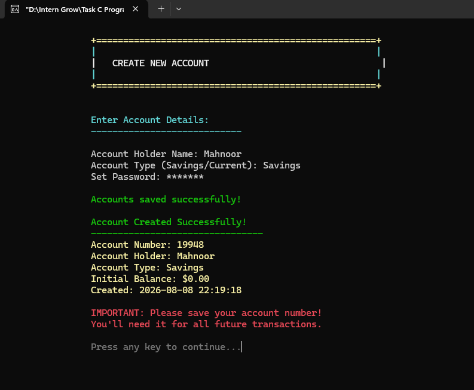

<br>

The screenshot demonstrates account creation, password masking, automatic account-number generation, and initial account information.

</td>
</tr>
</table>

---

# 💵 Deposit Money

The deposit feature allows authenticated users to add money to their account.

### Deposit Workflow

```text
Enter Account Number
        ↓
Find Account
        ↓
Check Account Status
        ↓
Enter Password
        ↓
Validate Password
        ↓
Enter Deposit Amount
        ↓
Validate Amount
        ↓
Update Balance
        ↓
Create Transaction
        ↓
Save to accounts.dat
```

### Deposit Validation

The system checks:

* Account existence
* Account status
* Password
* Positive amount
* Maximum deposit limit

The maximum deposit per transaction is:

```text
$50,000
```

After a successful deposit, the new balance is displayed.

---

# 📸 Deposit Money

<table>
<tr>
<td align="center">

### 03 — Deposit Money

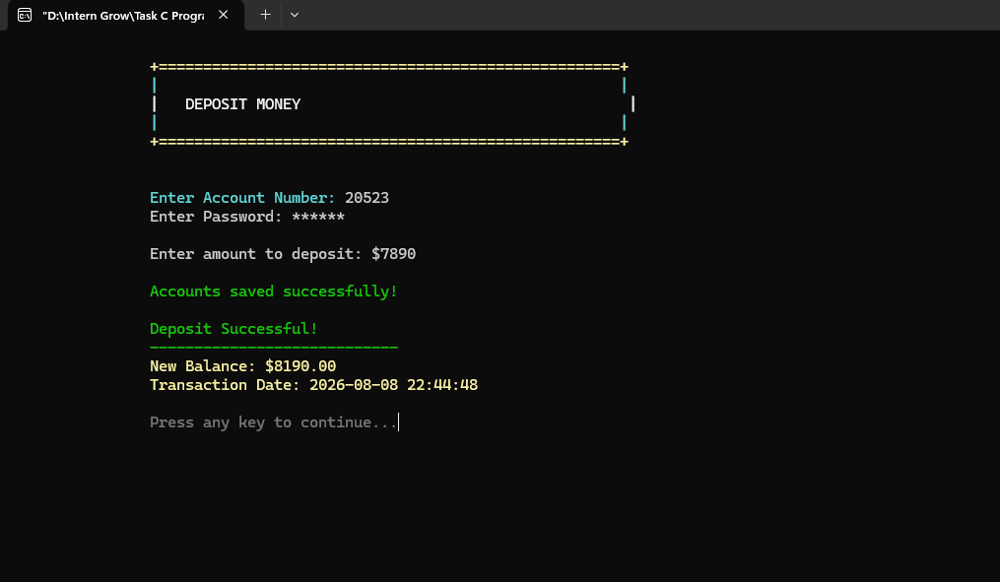

<br>

The system authenticates the account, accepts a valid deposit amount, updates the balance, creates a transaction record, and saves the updated account data.

</td>
</tr>
</table>

---

# 💳 Withdraw Money

The withdrawal feature provides several validation layers.

### Withdrawal Workflow

```text
Enter Account Number
        ↓
Find Account
        ↓
Check Account Status
        ↓
Password Verification
        ↓
Check Current Date
        ↓
Reset Daily Counter if Required
        ↓
Calculate Available Daily Limit
        ↓
Enter Withdrawal Amount
        ↓
Check Balance
        ↓
Check Daily Limit
        ↓
Check Per-Transaction Limit
        ↓
Update Balance
        ↓
Record Transaction
        ↓
Save Data
```

### Withdrawal Rules

The system uses:

```text
Daily Withdrawal Limit: $10,000
Maximum Per Transaction: $10,000
```

The program also tracks:

```text
daily_withdrawn
```

and automatically resets the daily withdrawal amount when a new date is detected.

---

# 📸 Withdraw Money

<table>
<tr>
<td align="center">

### 04 — Withdraw Money

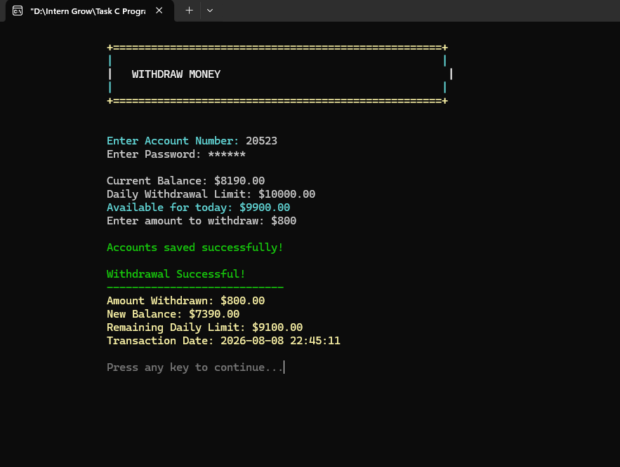

<br>

The withdrawal screen displays the current balance, daily withdrawal limit, available amount for the day, and the resulting balance after a successful withdrawal.

</td>
</tr>
</table>

---

# 💰 Balance Inquiry

Balance Inquiry provides authenticated users with detailed account information.

The screen displays:

* Account number
* Account holder
* Account type
* Account status
* Current balance
* Creation date
* Total transactions
* Daily withdrawal limit
* Today's withdrawals

Password authentication is required before displaying account details.

---

# 📸 Balance Inquiry

<table>
<tr>
<td align="center">

### 05 — Balance Inquiry

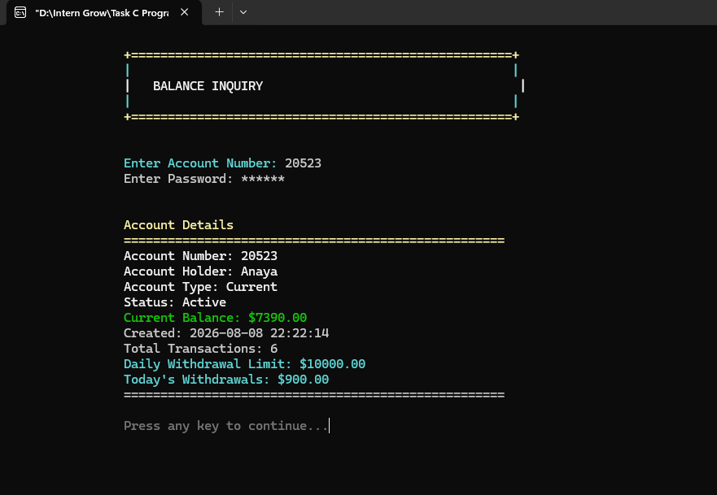

<br>

The screen provides a complete overview of the authenticated account.

</td>
</tr>
</table>

---

# 📜 Transaction History

Every successful banking operation creates a transaction record.

The transaction structure stores:

```text
Transaction Type
Amount
Balance After Transaction
Date & Time
Description
```

### Transaction Types

The application records operations such as:

```text
Account Created
Deposit
Withdrawal
Transfer Sent
Transfer Received
```

The transaction-history function displays the latest 20 transactions.

### Color Coding

The console interface uses:

* Green for positive transactions
* Red for outgoing transactions
* Yellow for headings
* Cyan for information

---

# 📸 Transaction History

<table>
<tr>
<td align="center">

### 06 — Transaction History

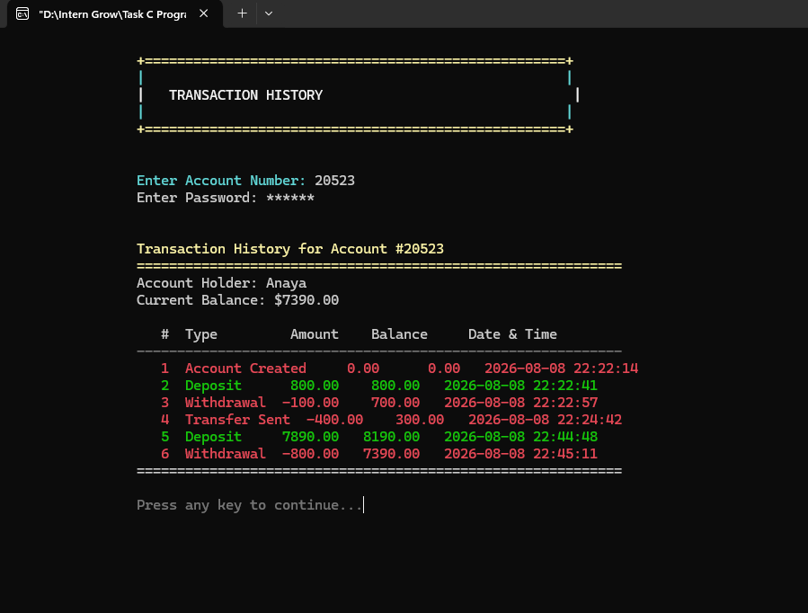

<br>

The transaction history displays transaction number, type, amount, balance after transaction, and date/time.

</td>
</tr>
</table>

---

# 🔎 Account Search

The Account Search feature allows an account to be located using its account number.

The search result displays:

```text
Account Number
Account Holder
Account Type
Status
Balance
Creation Date
Transaction Count
```

Unlike transaction operations, this search function does not request the account password.

---

# 📸 Account Search

<table>
<tr>
<td align="center">

### 07 — Account Search

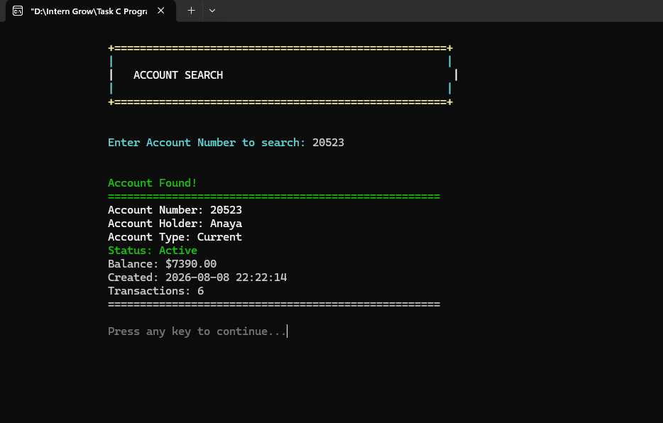

<br>

The application searches the in-memory account array and displays the matching account information.

</td>
</tr>
</table>

---

# 🔄 Transfer Money

The system supports transferring money from one registered account to another.

### Transfer Workflow

```text
Sender Account Number
        ↓
Check Sender Account
        ↓
Check Sender Status
        ↓
Verify Sender Password
        ↓
Recipient Account Number
        ↓
Check Recipient Account
        ↓
Check Recipient Status
        ↓
Enter Transfer Amount
        ↓
Check Sender Balance
        ↓
Check Transfer Limit
        ↓
Deduct Sender Balance
        ↓
Credit Recipient Balance
        ↓
Create Sender Transaction
        ↓
Create Recipient Transaction
        ↓
Save Data
```

### Transfer Limit

The maximum transfer amount per transaction is:

```text
$50,000
```

### Double-Sided Transaction Recording

For every successful transfer, two transaction records are created.

Sender:

```text
Transfer Sent
```

Recipient:

```text
Transfer Received
```

The sender's balance decreases while the recipient's balance increases.

---

# 🚫 Frozen Account Protection

The system prevents money transfers when the recipient account is frozen.

The transfer operation checks:

```c
if(!accounts[to_index].is_active)
```

If the recipient is frozen, the transaction is rejected.

This demonstrates practical conditional logic and account-status validation.

---

# 📸 Frozen Account Error Handling

<table>
<tr>
<td align="center">

### 08 — Transfer to Frozen Account

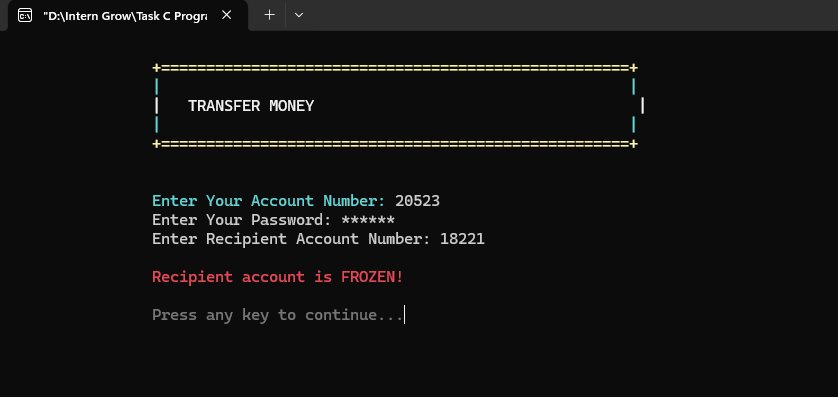

<br>

The application correctly rejects a transfer when the recipient account is frozen.

</td>
</tr>
</table>

---

# 📸 Successful Transfer

<table>
<tr>
<td align="center">

### 09 — Successful Money Transfer

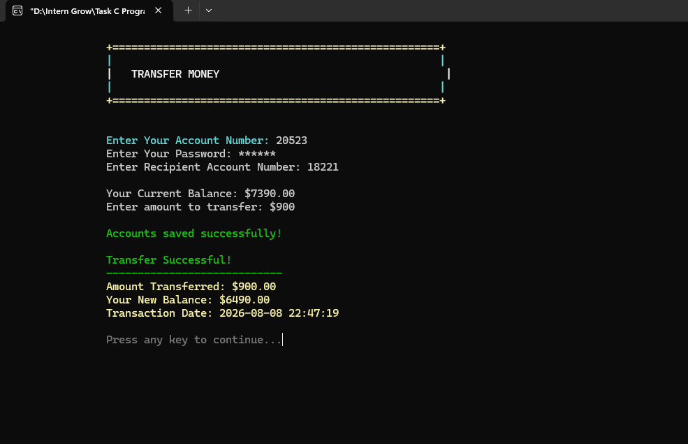

<br>

A successful transfer updates the sender and recipient balances and creates transaction records for both accounts.

</td>
</tr>
</table>

---

# 🔒 Freeze / Unfreeze Account

The system supports account status management.

An account can have one of two states:

```text
Active
Frozen
```

When an account is frozen, banking operations such as deposits, withdrawals, and transfers are blocked.

### Administrative Authentication

The current source code uses:

```text
admin123
```

as the administrative password for the freeze/unfreeze operation.

### Available Actions

```text
F → Freeze Account
U → Unfreeze Account
```

The status is stored in:

```c
int is_active;
```

where:

```text
1 = Active
0 = Frozen
```

---

# 📸 Freeze / Unfreeze Account

<table>
<tr>
<td align="center">

### 10 — Freeze / Unfreeze Account

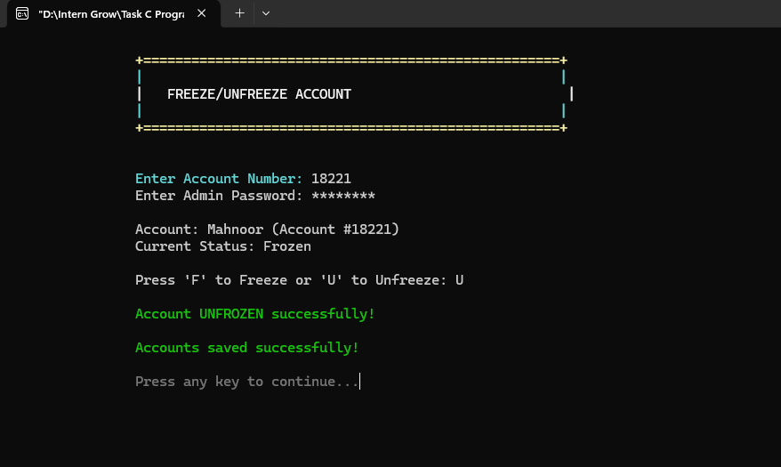

<br>

Administrative authentication allows the account status to be changed between Active and Frozen.

</td>
</tr>
</table>

---

# 🔑 Change Password

Users can change their account password through the Change Password feature.

### Password Change Workflow

```text
Account Number
      ↓
Current Password
      ↓
Validate Current Password
      ↓
Enter New Password
      ↓
Confirm New Password
      ↓
Compare Passwords
      ↓
Update Password
      ↓
Save Account Data
```

The system rejects the operation if the new password and confirmation password do not match.

---

# 📸 Change Password

<table>
<tr>
<td align="center">

### 11 — Change Password

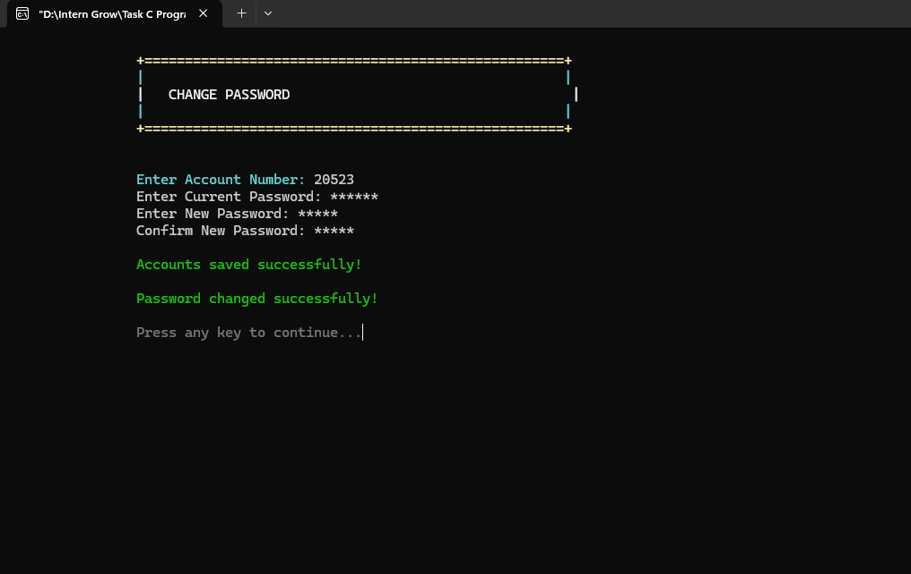

<br>

Passwords are entered using masked input and the new password must match the confirmation password.

</td>
</tr>
</table>

---

# 🗑️ Delete Account

The Delete Account feature permanently removes an account from the account array.

### Deletion Process

```text
Account Number
      ↓
Find Account
      ↓
Password Verification
      ↓
Display Warning
      ↓
User Confirmation
      ↓
Shift Remaining Accounts
      ↓
Decrease Account Count
      ↓
Save Updated Data
```

The application asks the user to confirm the operation:

```text
Are you sure you want to delete this account? (y/n)
```

If the user enters anything other than `y`, deletion is cancelled.

---

# 📸 Delete Account

<table>
<tr>
<td align="center">

### 12 — Delete Account

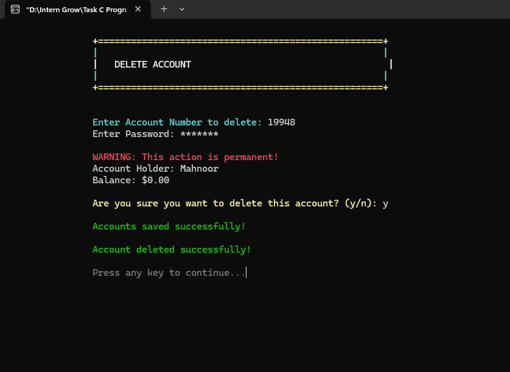

<br>

The application displays a warning, verifies the account password, asks for confirmation, and then removes the account.

</td>
</tr>
</table>

---

# 📋 View All Accounts

The View All Accounts feature displays all registered accounts in a formatted table.

The table contains:

```text
Account Number
Account Holder
Balance
Status
```

The application also calculates:

* Total accounts
* Active accounts
* Frozen accounts
* Total balance
* Average balance

### Average Balance

The system calculates:

```text
Average Balance =
Total Balance / Number of Accounts
```

---

# 📸 All Accounts — Initial View

<table>
<tr>
<td align="center">

### 13 — All Registered Accounts

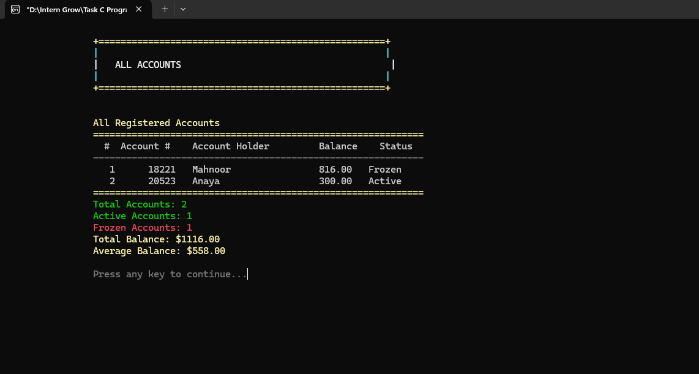

<br>

The initial account list displays registered accounts, balances, and account statuses.

</td>
</tr>
</table>

---

# 📸 All Accounts — Updated View

<table>
<tr>
<td align="center">

### 14 — Updated Account Summary

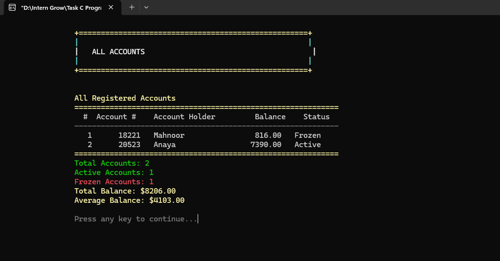

<br>

The updated view demonstrates changed account balances and the calculated banking statistics.

</td>
</tr>
</table>

---

# 📅 Monthly Statement

The Monthly Statement feature generates a transaction summary for a specific month.

The user enters the month in:

```text
YYYY-MM
```

format.

Example:

```text
2026-08
```

The system compares the first seven characters of each transaction date with the requested month.

### Statement Includes

* Account number
* Account holder
* Account type
* Transaction date
* Transaction description/type
* Transaction amount
* Balance after transaction
* Total credits
* Total debits
* Net change
* Closing balance
* Total transactions

### Monthly Calculations

Credits are calculated from positive transaction amounts.

Debits are calculated from negative transaction amounts.

The net change is:

```text
Net Change = Total Credits - Total Debits
```

---

# 📸 Monthly Statement

<table>
<tr>
<td align="center">

### 15 — Monthly Statement

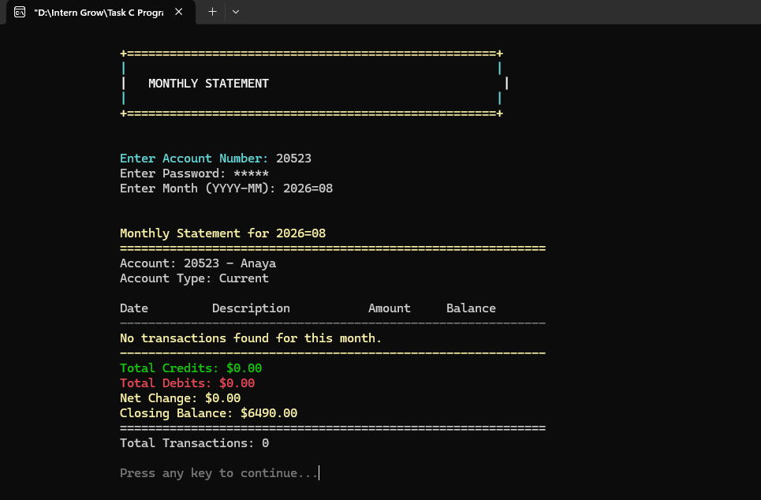

<br>

The monthly statement provides a month-specific summary of account activity and calculates total credits, total debits, net change, and closing balance.

</td>
</tr>
</table>

---

# 💾 File Handling

Persistent data storage is implemented through:

```text
accounts.dat
```

The application uses binary file operations.

---

## Loading Data

At program startup:

```c
loadFromFile();
```

is called.

The file is opened using:

```c
fopen("accounts.dat", "rb");
```

and records are loaded using:

```c
fread()
```

---

## Saving Data

When account information changes:

```c
saveToFile();
```

is called.

The file is opened using:

```c
fopen("accounts.dat", "wb");
```

and account records are written using:

```c
fwrite()
```

---

## File Handling Flow

```text
Program Starts
      ↓
loadFromFile()
      ↓
accounts.dat
      ↓
Load Account Records
      ↓
Perform Banking Operation
      ↓
Update Account Structure
      ↓
saveToFile()
      ↓
Write Updated Records
```

This provides persistent storage between program executions.

---

# 🔐 Password Protection

The application uses a custom password-input function:

```c
getPassword()
```

The function uses:

```c
getch()
```

from `conio.h`.

Instead of displaying the actual password, the console displays:

```text
******
```

### Password Verification

The system uses:

```c
validatePassword()
```

to compare the entered password with the stored password.

The following operations require account password verification:

* Deposit
* Withdrawal
* Balance inquiry
* Transaction history
* Delete account
* Transfer
* Change password
* Monthly statement

---

# 🛡️ Input Validation

The application provides reusable validation functions.

### Integer Validation

```c
getValidInt()
```

This function accepts:

* Prompt
* Minimum value
* Maximum value

For example, account numbers are restricted to:

```text
10000 - 99999
```

---

### Floating-Point Validation

```c
getValidFloat()
```

This function ensures that the entered amount is at least the required minimum.

For monetary input, the minimum is generally:

```text
0.01
```

---

### Password Input

```c
getPassword()
```

provides masked password input and supports:

* Character entry
* Backspace
* Enter key
* Maximum password length

---

# ⚠️ Error Handling

The application handles multiple invalid situations.

### Account Errors

```text
Account not found!
Account is FROZEN!
```

### Authentication Errors

```text
Invalid password!
Invalid admin password!
```

### Financial Errors

```text
Insufficient balance!
Daily withdrawal limit exceeded!
Maximum per transaction is $10,000!
Maximum deposit per transaction is $50,000!
Maximum transfer per transaction is $50,000!
```

### Transfer Errors

```text
Sender account not found!
Recipient account not found!
Your account is FROZEN!
Recipient account is FROZEN!
```

### Password Errors

```text
Passwords do not match!
```

These checks prevent invalid operations from modifying account data.

---

# 🎨 Console Interface

The application uses Windows console functionality to create a colored and structured user interface.

The project defines the following color constants:

```c
#define COLOR_WHITE 15
#define COLOR_YELLOW 14
#define COLOR_GREEN 10
#define COLOR_RED 12
#define COLOR_CYAN 11
#define COLOR_MAGENTA 13
#define COLOR_BLUE 9
#define COLOR_GRAY 8
```

The function:

```c
setColor()
```

uses:

```c
SetConsoleTextAttribute()
```

to change the console text color.

---

## 🎨 Color Usage

| Color   | Purpose                            |
| ------- | ---------------------------------- |
| White   | General information                |
| Yellow  | Headings and important information |
| Green   | Successful operations              |
| Red     | Errors and warnings                |
| Cyan    | Input and informational messages   |
| Magenta | Menu sections                      |
| Blue    | Additional menu options            |
| Gray    | Secondary prompts                  |

---

# 🧩 Important Functions

The project is organized into dedicated functions.

### Interface Functions

```c
setColor()
resetColor()
displayHeader()
clearScreen()
pauseScreen()
```

### Input Functions

```c
getValidInt()
getValidFloat()
getPassword()
```

### Date Function

```c
getCurrentDate()
```

### File Functions

```c
loadFromFile()
saveToFile()
```

### Account Functions

```c
createAccount()
accountSearch()
deleteAccount()
viewAllAccounts()
freezeAccount()
changePassword()
```

### Banking Functions

```c
depositMoney()
withdrawMoney()
balanceInquiry()
transferMoney()
transactionHistory()
monthlyStatement()
```

### Authentication / Search

```c
findAccount()
validatePassword()
```

---

# 🔄 Function Interaction

```text
                    main()
                      │
                      ▼
                loadFromFile()
                      │
                      ▼
                 Main Menu
                      │
        ┌─────────────┼──────────────┐
        │             │              │
        ▼             ▼              ▼
 createAccount   Banking Functions  Management
        │             │              │
        │        ┌────┼────┐         │
        │        │    │    │         │
        │        ▼    ▼    ▼         ▼
        │     Deposit Withdraw Transfer
        │        │    │    │       │
        └────────┴────┴────┴───────┘
                     │
                     ▼
                saveToFile()
                     │
                     ▼
                accounts.dat
```

---

# 📏 Banking Rules & Limits

| Feature                            | Current Rule      |
| ---------------------------------- | ----------------- |
| Maximum accounts                   | 100               |
| Transactions per account           | 200               |
| Displayed transaction history      | Latest 20         |
| Account number range               | 10000–99999       |
| Initial balance                    | $0.00             |
| Daily withdrawal limit             | $10,000           |
| Maximum withdrawal per transaction | $10,000           |
| Maximum deposit per transaction    | $50,000           |
| Maximum transfer per transaction   | $50,000           |
| Minimum transaction amount         | $0.01             |
| Account status                     | Active / Frozen   |
| Account types                      | Savings / Current |
| Monthly format                     | YYYY-MM           |

---

# 🧪 Demonstrated Test Scenarios

The screenshots included in this repository demonstrate several working scenarios.

### Account Management

* Create an account
* Search an account
* View all accounts
* Delete an account
* Change password

### Banking

* Deposit money
* Withdraw money
* Transfer money
* Check account balance

### Transaction Management

* Record deposits
* Record withdrawals
* Record transfers
* Display transaction history
* Generate monthly statements

### Security & Validation

* Password verification
* Masked password input
* Frozen account protection
* Admin authentication
* Insufficient balance protection
* Transaction limit protection

---

# 📸 Complete Application Showcase

The following images represent the complete working flow of the application.

---

## 01 — Main Menu


---

## 02 — Create New Account


---

## 03 — Deposit Money


---

## 04 — Withdraw Money


---

## 05 — Balance Inquiry


---

## 06 — Transaction History


---

## 07 — Account Search


---

## 08 — Frozen Account Transfer Protection


---

## 09 — Successful Money Transfer


---

## 10 — Freeze / Unfreeze Account


---

## 11 — Change Password


---

## 12 — Delete Account


---

## 13 — All Accounts Initial View


---

## 14 — All Accounts Updated View


---

## 15 — Monthly Statement


---

## 16 — Exit Screen

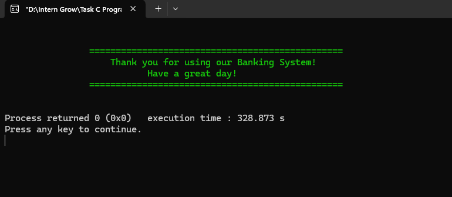

---

# 🗂️ Project Structure

```text
Task 6 Banking System/
│
├── 📁 images/
│   │
│   ├── 01-main-menu.png
│   ├── 02-create-account.png
│   ├── 03-deposit-money.png
│   ├── 04-withdraw-money.png
│   ├── 05-balance-inquiry.png
│   ├── 06-transaction-history.png
│   ├── 07-account-search.png
│   ├── 08-transfer-frozen-account.png
│   ├── 09-transfer-money-success.png
│   ├── 10-freeze-unfreeze-account.png
│   ├── 11-change-password.png
│   ├── 12-delete-account.png
│   ├── 13-all-accounts-initial.png
│   ├── 14-all-accounts-updated.png
│   ├── 15-monthly-statement.png
│   └── 16-thank-you-exit.png
│
├── 📄 main.c
├── 📄 README.md
└── 💾 accounts.dat
```

### Runtime File

`accounts.dat` is generated automatically by the program when account data is saved.

It does not need to be manually created before running the application.

---

# ▶️ How to Run

## Windows + GCC / MinGW

Open a terminal inside the project directory.

Compile:

```bash
gcc main.c -o banking.exe
```

Run:

```bash
banking.exe
```

---

## Code::Blocks

1. Open Code::Blocks.
2. Create or open a C project.
3. Add `main.c`.
4. Build the project.
5. Run the application.
6. Use the displayed menu to perform banking operations.

---

# 🖥️ Platform Compatibility

The current implementation is designed for **Windows**.

The source uses:

```c
#include <conio.h>
#include <windows.h>
```

and Windows-specific functions such as:

```c
SetConsoleTextAttribute()
GetStdHandle()
```

Therefore, a Windows-compatible C compiler/environment is recommended.

---

# 🧠 C Programming Concepts Demonstrated

<table>
<tr>
<td>

### Core Concepts

* Structures
* Nested structures
* Arrays
* Functions
* Function prototypes
* Global variables
* Conditional statements
* Switch statements
* Loops

</td>

<td>

### Practical Concepts

* File handling
* Binary files
* String manipulation
* Input validation
* Password masking
* Authentication
* Date/time processing
* Transaction processing
* Console formatting

</td>
</tr>
</table>

---

# 💡 Learning Outcomes

This project demonstrates practical understanding of how structured programming can be used to develop a real-world-style application.

### After completing this project, the following concepts are demonstrated:

```text
✓ Creating custom structures
✓ Nesting structures
✓ Managing arrays of structures
✓ Passing structures to functions
✓ Searching records
✓ Updating records
✓ Deleting records
✓ Reading binary files
✓ Writing binary files
✓ Validating user input
✓ Protecting account operations with passwords
✓ Recording transaction history
✓ Managing account status
✓ Processing date and time
✓ Building a menu-driven application
✓ Designing reusable functions
✓ Handling invalid operations
```

---

# ⚠️ Security & Educational Limitations

This project is designed for **educational and internship purposes** and should not be considered a production banking system.

### Current limitations include:

* Passwords are stored directly in the `Account` structure.
* Passwords are not cryptographically hashed.
* The administrative password is hard-coded as `admin123`.
* Account numbers are randomly generated.
* The current code does not explicitly perform a duplicate account-number check.
* Account storage uses fixed-size arrays.
* Transaction storage uses a fixed limit of 200 records per account.
* Data is stored in a local binary file.
* There is no database server.
* There is no encryption layer.
* There is no network communication.
* The application is Windows-specific.

These limitations are acceptable for demonstrating C programming concepts, structures, file handling, functions, and conditional logic in an internship project.

---

# 🚀 Possible Future Enhancements

The system can be extended with:

* Secure password hashing
* Encrypted account files
* Database integration
* SQLite/MySQL support
* Dynamic memory allocation
* Duplicate account-number prevention
* Stronger password rules
* Login attempt limits
* Admin dashboard
* Role-based access control
* Account statements exported to PDF
* Transaction receipt generation
* Interest calculation for savings accounts
* Beneficiary management
* Account-to-account transfer confirmation
* Backup and restore functionality
* Audit logs
* Cross-platform console support
* Graphical user interface

---

# 🧪 Example Banking Flow

```text
                 CREATE ACCOUNT
                       │
                       ▼
              Account # Generated
                       │
                       ▼
                 Initial Balance
                    $0.00
                       │
                       ▼
                  DEPOSIT
                       │
                       ▼
              Balance Increased
                       │
                       ▼
                 WITHDRAWAL
                       │
                       ▼
              Balance Decreased
                       │
                       ▼
                  TRANSFER
                       │
              ┌────────┴────────┐
              ▼                 ▼
       Sender Balance      Receiver Balance
          Decreased             Increased
              │                 │
              └────────┬────────┘
                       ▼
               TRANSACTION HISTORY
                       │
                       ▼
                MONTHLY STATEMENT
```

---

# 🏁 Conclusion

The **Advanced Banking Management System** combines fundamental C programming concepts with a practical banking scenario.

The project goes beyond basic account creation and balance management by implementing:

```text
Account Management
        +
Banking Transactions
        +
Password Protection
        +
Transaction History
        +
File Persistence
        +
Account Status Management
        +
Monthly Reporting
        +
Input Validation
        +
Error Handling
```

Through structures, functions, arrays, binary file handling, conditional logic, loops, string operations, and date/time functions, the application provides a complete educational demonstration of structured C programming.

The project also demonstrates how account data can be maintained persistently through `accounts.dat`, while transaction records remain associated with their respective accounts.

---

# 👩‍💻 Project Information

| Information      | Details                            |
| ---------------- | ---------------------------------- |
| Project          | Advanced Banking Management System |
| Language         | C                                  |
| Type             | Console Application                |
| Platform         | Windows                            |
| Storage          | Binary File                        |
| Main Source File | `main.c`                           |
| Data File        | `accounts.dat`                     |
| Documentation    | `README.md`                        |
| Screenshots      | `images/`                          |

---

# ⭐ Project Highlights

```text
╔══════════════════════════════════════════════════════╗
║                                                      ║
║          🏦 ADVANCED BANKING SYSTEM                 ║
║                                                      ║
║   👤 Account Management                              ║
║   💵 Deposit & Withdrawal                            ║
║   🔄 Money Transfer                                  ║
║   💰 Balance Inquiry                                 ║
║   📜 Transaction History                             ║
║   🔎 Account Search                                  ║
║   🔒 Freeze / Unfreeze                               ║
║   🔑 Password Management                             ║
║   📅 Monthly Statements                              ║
║   💾 Binary File Storage                             ║
║   🛡️ Input Validation                               ║
║   ⚠️ Error Handling                                  ║
║                                                      ║
╚══════════════════════════════════════════════════════╝
```

---

# 👋 Exit

<p align="center">
  
</p>

<p align="center">
  <b>Thank you for using the Advanced Banking Management System!</b>
</p>

<p align="center">
  Built with C • Structures • Functions • File Handling
</p>

<p align="center">
  ⭐ Banking Management System ⭐
</p>
