# 📦 INVENTORY MANAGEMENT SYSTEM

<p align="center">

### Task 3 — Week 3 | C Programming

A complete console-based Inventory Management System developed in **C** using:

**Structures • Arrays • File I/O • Searching • Sorting • Binary Search**

<p>


</p>

</p>

---

# 📌 PROJECT OVERVIEW

The **Inventory Management System** is a menu-driven C application designed to manage products, monitor stock, search inventory records, perform sorting operations, and generate useful inventory reports.

The project is implemented in a single C source file named:

```text
main.c
```

The system uses a binary file:

```text
inventory.dat
```

to store product data so that inventory records can persist after the program is closed.

The application demonstrates the core programming concepts required for the task:

- Structures
- Arrays
- Functions
- File I/O
- Searching
- Sorting
- Binary Search
- String handling
- Input validation
- Data manipulation
- Report generation
- Console formatting

---

# 🎯 TASK OBJECTIVES

The main objective of this project is to build an inventory system capable of managing product records and performing common inventory operations.

### Required Features

| Feature | Status |
|---|:---:|
| Add Product | ✅ |
| Update Product | ✅ |
| Delete Product | ✅ |
| Search Products | ✅ |
| Stock Management | ✅ |
| Sales Report | ✅ |
| File-Based Database | ✅ |
| Sorting | ✅ |
| Binary Search | ✅ |

### Core Skills

| Skill | Used In |
|---|---|
| Arrays | Product storage |
| Structures | Product records |
| File I/O | Persistent storage |
| Searching | Product lookup |
| Sorting | Product organization |
| Binary Search | Fast name-based search |

---

# 🗂️ REPOSITORY STRUCTURE

```text
Task 3 Inventory Management System/
│
├── main.c
├── README.md
│
└── images/
    ├── .gitkeep
    ├── 01_Main_Menu.png
    ├── 02_Add_Product.png
    ├── 03_View_All_Products.png
    ├── 04_Update_Product.png
    ├── 05_Delete_Product.png
    ├── 06_Search_Products.png
    ├── 07_Search_Results.png
    ├── 08_Stock_Management.png
    ├── 09_Sales_Report.png
    ├── 10_Sort_Products_Menu.png
    ├── 11_Sorted_Products.png
    ├── 12_Binary_Search_Input.png
    ├── 13_Binary_Search_Result.png
    ├── 14_All_Products_Final.png
    ├── 15_Low_Stock_Report.png
    ├── 16_Category_Report.png
    └── 17_Supplier_Report.png
```

> `inventory.dat` is a runtime data file created by the program when inventory data is saved.

---

# 🖥️ APPLICATION PREVIEW

<p align="center">
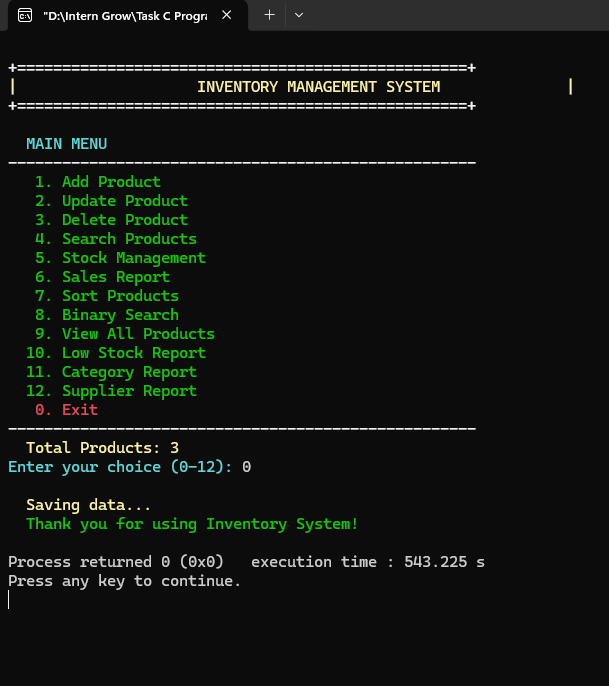
</p>

The application starts with a clean, menu-driven console interface that provides access to every major inventory operation.

---

# ✨ KEY FEATURES

<table>
<tr>
<td width="50%">

## 🛒 PRODUCT MANAGEMENT

✔ Add Product  
✔ Update Product  
✔ Delete Product  
✔ View All Products  
✔ Auto-generated Product IDs  

</td>

<td width="50%">

## 🔎 SEARCHING

✔ Search by Name  
✔ Search by Category  
✔ Search by Supplier  
✔ Case-insensitive matching  
✔ Partial/substring matching  

</td>
</tr>

<tr>
<td>

## 📦 STOCK MANAGEMENT

✔ Update stock quantity  
✔ Display current stock  
✔ Display reorder level  
✔ Detect low stock  
✔ Restocking warning  

</td>

<td>

## 📊 REPORTING

✔ Sales Report  
✔ Low Stock Report  
✔ Category Report  
✔ Supplier Report  
✔ Revenue & Profit calculations  

</td>
</tr>

<tr>
<td>

## 🔃 SORTING

✔ Sort by Name  
✔ Sort by Price  
✔ Sort by Quantity  
✔ Sort by Category  
✔ Uses C `qsort()`  

</td>

<td>

## ⚡ BINARY SEARCH

✔ Sorts products by name  
✔ Iterative Binary Search  
✔ O(log n) search  
✔ Displays matching product  

</td>
</tr>
</table>

---

# 🧱 PRODUCT DATA STRUCTURE

The application uses a `Product` structure to keep all information about a product together.

```c
typedef struct {
    int id;
    char name[MAX_NAME_LEN];
    char category[MAX_CATEGORY_LEN];
    int quantity;
    double price;
    double cost_price;
    char supplier[MAX_SUPPLIER_LEN];
    time_t added_date;
    time_t last_updated;
    int reorder_level;
    int sold_count;
} Product;
```

### Product Fields

| Field | Type | Description |
|---|---|---|
| `id` | `int` | Product ID |
| `name` | `char[]` | Product name |
| `category` | `char[]` | Product category |
| `quantity` | `int` | Current stock quantity |
| `price` | `double` | Selling price |
| `cost_price` | `double` | Cost price |
| `supplier` | `char[]` | Supplier name |
| `added_date` | `time_t` | Product creation timestamp |
| `last_updated` | `time_t` | Last update timestamp |
| `reorder_level` | `int` | Minimum recommended stock |
| `sold_count` | `int` | Number of units sold |

The maximum number of products is defined as:

```c
#define MAX_PRODUCTS 1000
```

Therefore, the application can hold up to **1000 product records** in memory.

---

# 🏠 1. MAIN MENU

The main menu is implemented through the `display_menu()` function.

```text
MAIN MENU
----------------------------------------------------
  1. Add Product
  2. Update Product
  3. Delete Product
  4. Search Products
  5. Stock Management
  6. Sales Report
  7. Sort Products
  8. Binary Search
  9. View All Products
 10. Low Stock Report
 11. Category Report
 12. Supplier Report
  0. Exit
----------------------------------------------------
```

The selected option is processed through a `switch` statement in `main()`.

### Screenshot

<p align="center">

</p>

---

# ➕ 2. ADD PRODUCT

The `add_product()` function creates a new product record.

### Product Information

The user enters:

```text
Product Name
Category
Quantity
Selling Price
Cost Price
Supplier
Reorder Level
```

The Product ID is automatically generated by the program.

The source uses:

```c
new_product.id = product_count + 1001;
```

The program also records:

```c
new_product.added_date = time(NULL);
new_product.last_updated = time(NULL);
new_product.sold_count = 0;
```

After adding the product, the program immediately calls:

```c
save_data();
```

so the updated inventory is stored in the data file.

### Screenshot

<p align="center">
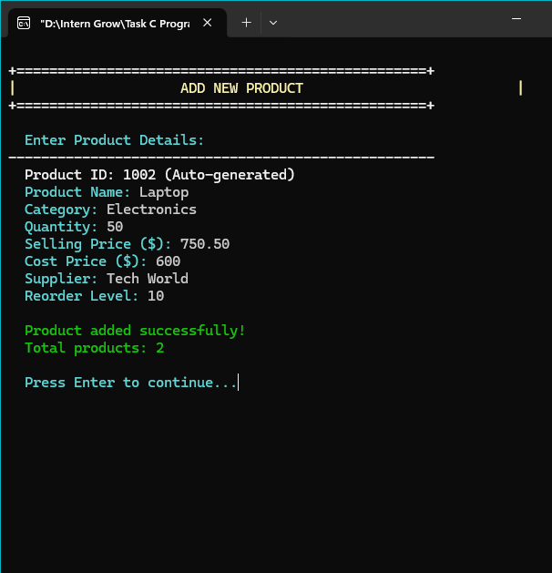
</p>

---

# 📋 3. VIEW ALL PRODUCTS

The `display_products()` function displays every product currently stored in the inventory array.

Each product is displayed as a formatted console card containing:

```text
ID
Quantity
Sold
Name
Category
Price
Cost
Supplier
Reorder Level
```

The individual product display is handled by:

```c
display_product()
```

### Screenshot

<p align="center">
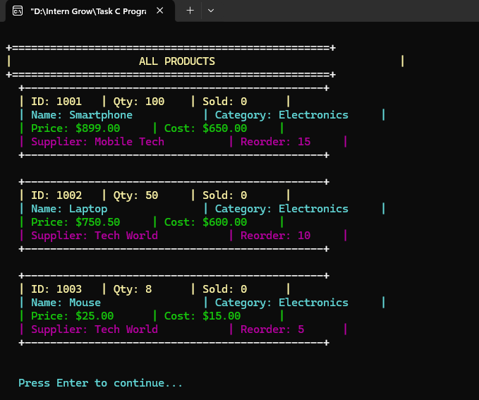
</p>

---

# ✏️ 4. UPDATE PRODUCT

The `update_product()` function allows an existing product to be modified.

### Update Process

```text
Select Update Product
        ↓
Enter Product ID
        ↓
Find Product
        ↓
Display Current Details
        ↓
Enter New Values
        ↓
Update Record
        ↓
Update Timestamp
        ↓
Save Data
```

The following fields can be updated:

- Product Name
- Category
- Quantity
- Price
- Cost Price
- Supplier
- Reorder Level

The program allows the user to press Enter to keep the current value for the text fields.

### Screenshot

<p align="center">
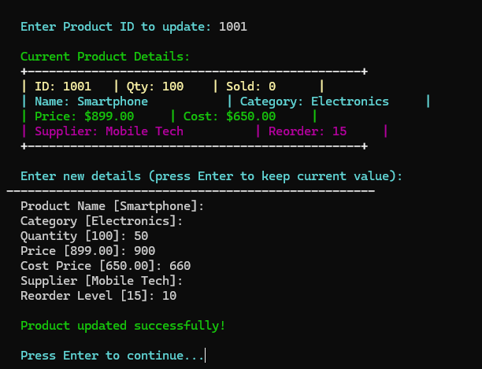
</p>

---

# 🗑️ 5. DELETE PRODUCT

The `delete_product()` function removes a product from the inventory.

Before deletion, the system displays the selected product and asks for confirmation.

```text
Are you sure you want to delete this product?

Enter 1 to confirm deletion, 0 to cancel:
```

If the user confirms, the remaining array elements are shifted one position to fill the deleted record.

```c
for (int i = index; i < product_count - 1; i++) {
    products[i] = products[i + 1];
}

product_count--;
```

The updated data is then saved.

### Screenshot

<p align="center">
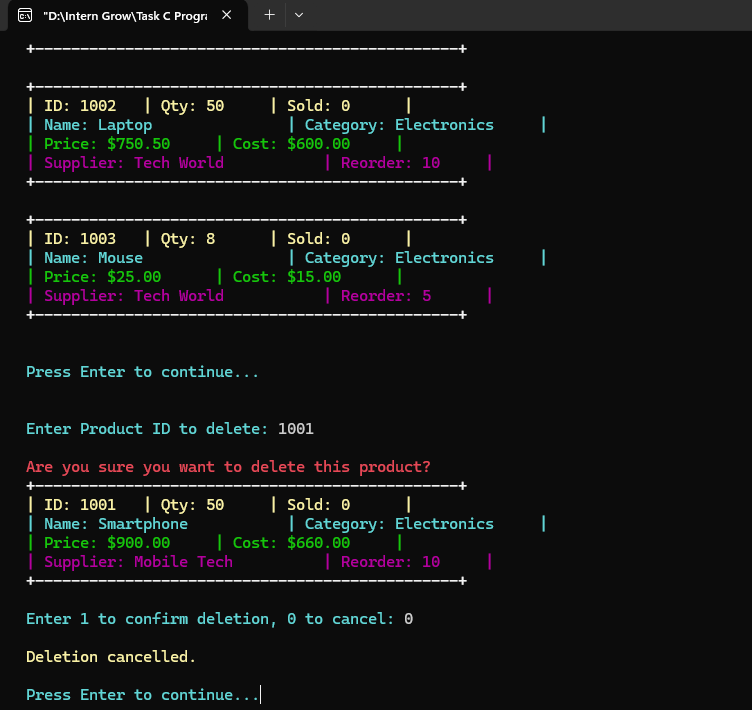
</p>

---

# 🔎 6. SEARCH PRODUCTS

The search module provides three search options:

```text
1. Name
2. Category
3. Supplier
```

### Search Logic

The program converts both the search term and comparison value to lowercase.

It then uses:

```c
strstr()
```

to check whether the search text occurs inside the stored value.

Therefore, searching is:

- Case-insensitive
- Partial/substring based

For example:

```text
Search: phone
```

can match:

```text
Smartphone
```

### Search Menu

<p align="center">
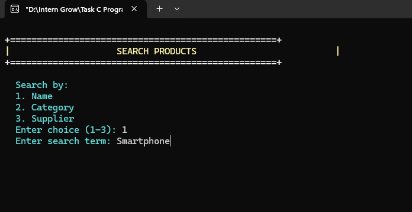
</p>

### Search Results

<p align="center">
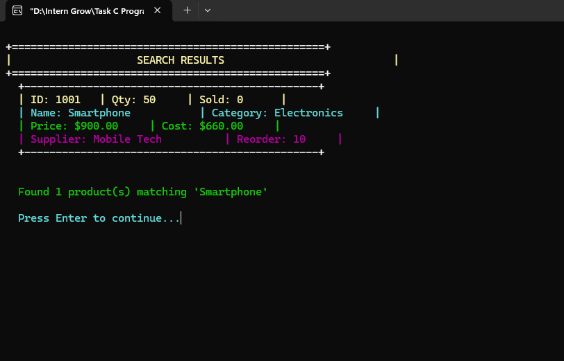
</p>

---

# 📦 7. STOCK MANAGEMENT

The `stock_management()` function is responsible for changing the current quantity of a product.

The program displays:

```text
Current Stock
Reorder Level
```

The user then enters a new quantity.

The program calculates the difference between the old and new quantities.

```text
New Quantity - Old Quantity
```

The result is reported as:

```text
Added units
Removed units
No change
```

If the new quantity is at or below the reorder level, the system displays a warning.

### Screenshot

<p align="center">
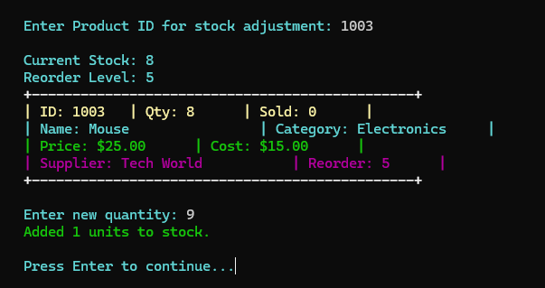
</p>

---

# 💰 8. SALES REPORT

The `sales_report()` function calculates sales information using:

```text
sold_count
price
cost_price
```

For each product:

```text
Revenue = Sold Quantity × Selling Price

Cost = Sold Quantity × Cost Price

Profit = Revenue − Cost
```

The report also calculates:

```text
Total Items Sold
Total Revenue
Total Cost
Total Profit
Profit Margin
```

The profit margin is calculated as:

```text
Profit Margin = (Total Profit / Total Revenue) × 100
```

when revenue is greater than zero.

### Screenshot

<p align="center">
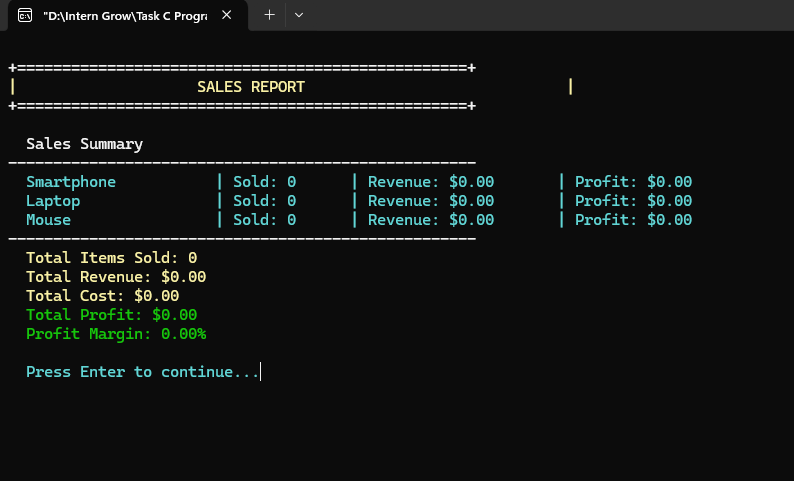
</p>

### ⚠️ Implementation Note

The current `main.c` contains the `sold_count` field and the complete sales-report calculation, but it does **not** contain a separate menu option for recording a sale.

New products are initialized with:

```c
sold_count = 0;
```

Therefore, the Sales Report will show zero sales unless the stored data already contains non-zero `sold_count` values.

---

# 🔃 9. SORT PRODUCTS

The application provides four sorting options:

```text
1. Name
2. Price
3. Quantity
4. Category
```

The program uses the standard C library function:

```c
qsort()
```

### Comparator Functions

```c
compare_by_name()
compare_by_price()
compare_by_quantity()
compare_by_category()
```

### Sort Menu

<p align="center">
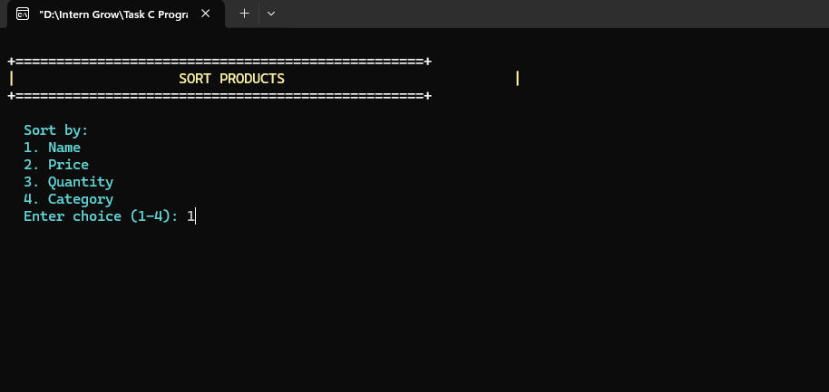
</p>

### Sorted Products

<p align="center">
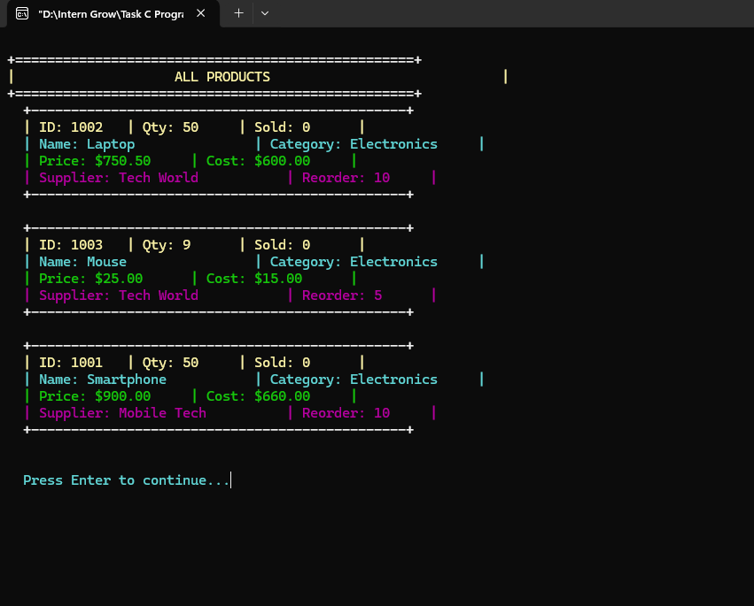
</p>

### Sorting Complexity

`qsort()` is generally **O(n log n)** for typical implementations.

---

# ⚡ 10. BINARY SEARCH

Binary Search is included as an upgrade feature.

Because Binary Search requires sorted data, the application first sorts products by name:

```c
qsort(products, product_count, sizeof(Product), compare_by_name);
```

The program then performs an iterative Binary Search.

### Algorithm

```text
Start
  ↓
Sort Products by Name
  ↓
Set Left = 0
Set Right = Last Index
  ↓
Calculate Middle
  ↓
Compare Search Name with Middle
  ↓
 ┌───────────────┬────────────────┐
 │               │                │
Equal          Smaller          Larger
 │               │                │
 ▼               ▼                ▼
Found        Search Left      Search Right
```

The middle index is calculated using:

```c
int mid = left + (right - left) / 2;
```

### Binary Search Input

<p align="center">
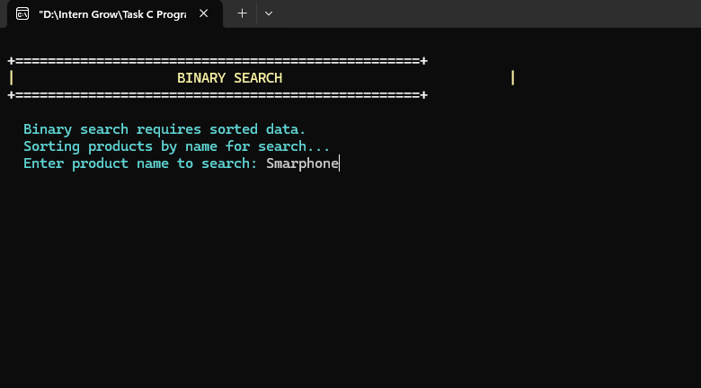
</p>

### Binary Search Result

<p align="center">
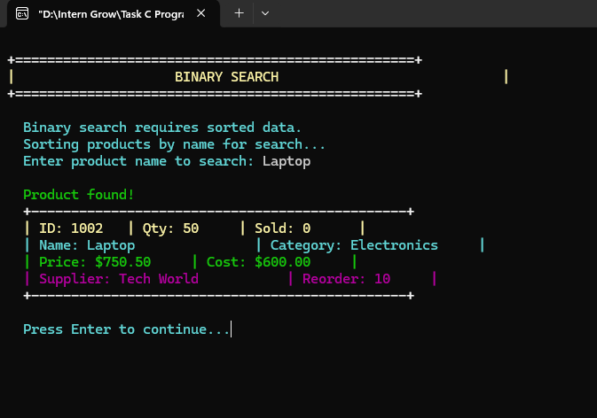
</p>

### Complexity

```text
Binary Search = O(log n)
```

The important requirement is that the product array must be sorted by name before searching.

---

# 📊 11. FINAL ALL PRODUCTS

After performing product operations, the system can display the current inventory state.

This demonstrates that product records are updated and maintained throughout the application.

### Screenshot

<p align="center">
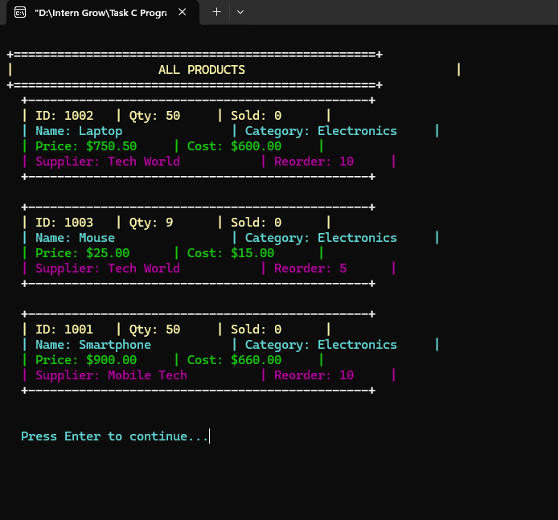
</p>

---

# ⚠️ 12. LOW STOCK REPORT

The `generate_low_stock_report()` function identifies products whose quantity is less than or equal to their reorder level.

The condition used is:

```c
products[i].quantity <= products[i].reorder_level
```

If no product requires restocking, the program displays:

```text
All products are above reorder level.
```

Otherwise, the system displays the products that need attention.

### Screenshot

<p align="center">
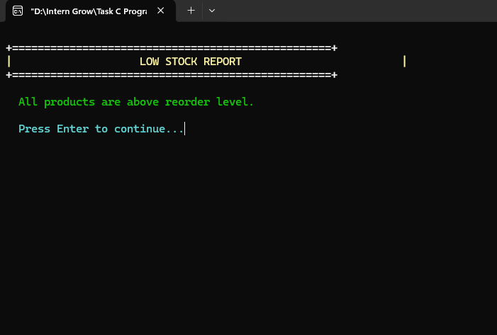
</p>

---

# 🗂️ 13. CATEGORY REPORT

The `generate_category_report()` function groups products according to their category.

The program creates temporary arrays for:

```text
Category Names
Category Counts
```

It then counts how many products belong to each unique category.

### Example

```text
Category Distribution
------------------------------------------------
Electronics : 3 products
```

### Screenshot

<p align="center">
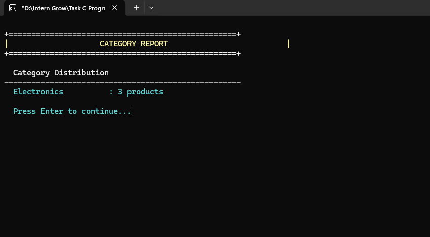
</p>

---

# 🚚 14. SUPPLIER REPORT

The `generate_supplier_report()` function groups inventory records by supplier.

For every unique supplier, the system calculates:

- Number of products
- Total inventory value

The inventory value is calculated using:

```text
Selling Price × Quantity
```

### Example

```text
Supplier Summary

Tech World  : 2 products | Total Value: $37750.00
Mobile Tech : 1 products | Total Value: $45000.00
```

### Screenshot

<p align="center">
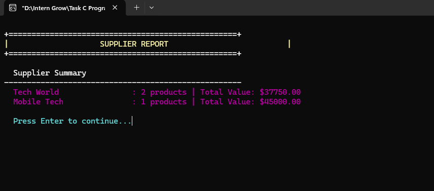
</p>

---

# 💾 FILE-BASED DATABASE

The project uses a binary file as its database.

```c
#define FILENAME "inventory.dat"
```

### Loading

At startup:

```c
load_data();
```

The program opens:

```c
fopen(FILENAME, "rb");
```

and reads:

```c
fread(&product_count, sizeof(int), 1, file);
fread(products, sizeof(Product), product_count, file);
```

### Saving

The program saves data using:

```c
save_data();
```

The file is opened using:

```c
fopen(FILENAME, "wb");
```

and data is written using:

```c
fwrite(&product_count, sizeof(int), 1, file);
fwrite(products, sizeof(Product), product_count, file);
```

### Data Flow

```text
                PROGRAM START
                     │
                     ▼
                load_data()
                     │
                     ▼
              inventory.dat
                     │
                     ▼
             Product Array
                     │
        ┌────────────┼────────────┐
        ▼            ▼            ▼
      Add         Update        Delete
        │            │            │
        └────────────┼────────────┘
                     │
                     ▼
                 save_data()
                     │
                     ▼
              inventory.dat
```

---

# 🧠 C PROGRAMMING CONCEPTS

## 1. Structures

The `Product` structure stores multiple related values in one record.

## 2. Arrays

Products are stored in:

```c
Product products[MAX_PRODUCTS];
```

## 3. Functions

The application is divided into separate functions for each operation.

## 4. File I/O

The program uses:

```c
fopen()
fread()
fwrite()
fclose()
```

## 5. Strings

The program uses:

```c
strlen()
strcpy()
strcmp()
strstr()
strcspn()
tolower()
```

## 6. Searching

The application includes normal sequential searching and Binary Search.

## 7. Sorting

The project uses C's standard `qsort()` function.

## 8. Time Handling

The program uses:

```c
time(NULL)
```

for product creation and update timestamps.

---

# 🛡️ INPUT VALIDATION

The source includes reusable validation functions:

```c
get_valid_int()
get_valid_double()
```

### Integer Validation

Used for:

- Menu choices
- Quantity
- Reorder level
- Product IDs
- Confirmation choices

### Double Validation

Used for:

- Selling Price
- Cost Price

The functions repeatedly ask for input until a value falls inside the allowed range.

Example:

```c
choice = get_valid_int(
    "Enter your choice (0-12): ",
    0,
    12
);
```

---

# 🎨 CONSOLE INTERFACE

The program provides a colorized terminal interface.

The source defines multiple colors:

```c
COLOR_RED
COLOR_GREEN
COLOR_YELLOW
COLOR_BLUE
COLOR_MAGENTA
COLOR_CYAN
COLOR_WHITE
```

It also uses platform-specific commands.

### Windows

```c
system("cls");
```

### Linux / macOS

```c
system("clear");
```

Windows uses the `Windows.h` console API for colors, while non-Windows systems use ANSI escape sequences.

This gives the application a more organized and visually clear console experience.

---

# 🧩 FUNCTION REFERENCE

| Function | Purpose |
|---|---|
| `main()` | Controls application flow |
| `load_data()` | Loads products from `inventory.dat` |
| `save_data()` | Saves products to `inventory.dat` |
| `display_menu()` | Displays main menu |
| `add_product()` | Adds a new product |
| `update_product()` | Updates an existing product |
| `delete_product()` | Deletes a product |
| `search_products()` | Searches products |
| `stock_management()` | Adjusts stock quantity |
| `sales_report()` | Generates sales calculations |
| `sort_products()` | Sorts products |
| `binary_search_product()` | Performs Binary Search |
| `display_product()` | Displays one product |
| `display_products()` | Displays all products |
| `generate_low_stock_report()` | Finds low-stock products |
| `generate_category_report()` | Groups products by category |
| `generate_supplier_report()` | Groups products by supplier |
| `set_screen_color()` | Changes console color |
| `print_header()` | Displays section headers |
| `print_separator()` | Displays separators |
| `wait_for_enter()` | Pauses the screen |
| `get_valid_int()` | Validates integer input |
| `get_valid_double()` | Validates decimal input |
| `to_lowercase()` | Converts text to lowercase |
| `compare_by_name()` | Name sorting comparator |
| `compare_by_price()` | Price sorting comparator |
| `compare_by_quantity()` | Quantity sorting comparator |
| `compare_by_category()` | Category sorting comparator |

---

# 📐 ALGORITHM COMPLEXITY

| Operation | Approach | Complexity |
|---|---|---:|
| View Products | Sequential traversal | O(n) |
| Search | Sequential scan | O(n) |
| Delete | Search + array shifting | O(n) |
| Update | Sequential ID search | O(n) |
| Stock Management | Sequential ID search | O(n) |
| Sorting | `qsort()` | Average O(n log n) |
| Binary Search | Iterative | O(log n) |
| Category Report | Nested comparison | O(n²) worst case |
| Supplier Report | Nested comparison | O(n²) worst case |

---

# 🔄 COMPLETE SYSTEM WORKFLOW

```text
                    ┌─────────────────┐
                    │  START PROGRAM  │
                    └────────┬────────┘
                             │
                             ▼
                      ┌────────────┐
                      │ load_data()│
                      └─────┬──────┘
                            │
                            ▼
                     ┌──────────────┐
                     │  MAIN MENU   │
                     └──────┬───────┘
                            │
       ┌────────────────────┼────────────────────┐
       │                    │                    │
       ▼                    ▼                    ▼
 PRODUCT MANAGEMENT     SEARCH & SORT         REPORTS
       │                    │                    │
       ├─ Add               ├─ Search            ├─ Sales
       ├─ Update            ├─ Sort              ├─ Low Stock
       └─ Delete            └─ Binary Search     ├─ Category
                                                 └─ Supplier
       │                    │                    │
       └────────────────────┼────────────────────┘
                            │
                            ▼
                      ┌────────────┐
                      │ save_data()│
                      └─────┬──────┘
                            │
                            ▼
                         ┌──────┐
                         │ EXIT │
                         └──────┘
```

---

# ▶️ HOW TO RUN

## Windows — GCC

Open the terminal inside the project folder.

### Compile

```bash
gcc main.c -o inventory
```

### Run

```bash
inventory.exe
```

---

## Linux / macOS

### Compile

```bash
gcc main.c -o inventory
```

### Run

```bash
./inventory
```

---

# 🧰 REQUIREMENTS

To run the project, you need:

- C compiler
- GCC recommended
- Windows, Linux, or macOS
- Terminal / Command Prompt
- Write permission in the project directory

Recommended environments:

```text
Visual Studio Code
Code::Blocks
Dev-C++
GCC
```

---

# 📁 RUNTIME FILE

When the application saves data, it creates:

```text
inventory.dat
```

This file stores:

```text
Product Count
+
Product Records
```

If `inventory.dat` does not exist when the program starts, the application automatically starts with an empty inventory.

---

# 🧪 TESTED FUNCTIONAL FLOW

The screenshots included in this repository demonstrate the following workflow:

```text
1. Open Inventory Management System
        ↓
2. Add Product
        ↓
3. View All Products
        ↓
4. Update Product
        ↓
5. Delete Product
        ↓
6. Search Product
        ↓
7. Manage Stock
        ↓
8. Generate Sales Report
        ↓
9. Sort Products
        ↓
10. Perform Binary Search
        ↓
11. View Final Inventory
        ↓
12. Generate Low Stock Report
        ↓
13. Generate Category Report
        ↓
14. Generate Supplier Report
```

---

# 📸 SCREENSHOT GALLERY

The following screenshots are included in the repository and linked directly using the `images/` folder.

| # | Feature | Screenshot |
|---|---|---|
| 01 | Main Menu | `01_Main_Menu.png` |
| 02 | Add Product | `02_Add_Product.png` |
| 03 | View All Products | `03_View_All_Products.png` |
| 04 | Update Product | `04_Update_Product.png` |
| 05 | Delete Product | `05_Delete_Product.png` |
| 06 | Search Products | `06_Search_Products.png` |
| 07 | Search Results | `07_Search_Results.png` |
| 08 | Stock Management | `08_Stock_Management.png` |
| 09 | Sales Report | `09_Sales_Report.png` |
| 10 | Sort Products | `10_Sort_Products_Menu.png` |
| 11 | Sorted Products | `11_Sorted_Products.png` |
| 12 | Binary Search Input | `12_Binary_Search_Input.png` |
| 13 | Binary Search Result | `13_Binary_Search_Result.png` |
| 14 | Final Products | `14_All_Products_Final.png` |
| 15 | Low Stock Report | `15_Low_Stock_Report.png` |
| 16 | Category Report | `16_Category_Report.png` |
| 17 | Supplier Report | `17_Supplier_Report.png` |

---

# 🚀 FUTURE ENHANCEMENTS

The current system can be expanded with:

- 👤 User Authentication
- 🔐 Admin and Staff Roles
- 🛒 Record Sale Feature
- 🧾 Invoice Generation
- 👥 Customer Management
- 🚚 Purchase Management
- 📦 Supplier Management
- 📅 Sales History
- 📈 Graphical Dashboard
- 📊 Advanced Analytics
- 📁 CSV Export
- 💾 Automatic Backup
- 🗄️ SQLite / MySQL Database
- 🔖 Barcode Support
- 🖥️ GUI Version

---

# ⚠️ CURRENT IMPLEMENTATION NOTES

This README documents the behavior of the supplied `main.c`.

### Product ID Generation

The current code generates IDs using:

```c
new_product.id = product_count + 1001;
```

This is suitable for the demonstrated project but is not a permanent unique-ID mechanism.

### Binary Search

Binary Search uses:

```c
strcmp()
```

for product names, so the Binary Search itself is case-sensitive.

### Sales

The source contains:

```c
sold_count
```

and a complete Sales Report calculation.

However, there is currently no separate menu operation that records a sale and increments `sold_count`.

### Stock

Stock Management changes the product's quantity and checks the reorder level.

It does not automatically record a sale.

---

# 🏆 PROJECT HIGHLIGHTS

<table>
<tr>
<td align="center" width="33%">

## 🧱 STRUCTURED

Uses structures, arrays, functions, and modular logic.

</td>

<td align="center" width="33%">

## 💾 PERSISTENT

Stores inventory data using binary file I/O.

</td>

<td align="center" width="33%">

## ⚡ ALGORITHMIC

Uses sorting and Binary Search for efficient data handling.

</td>
</tr>

<tr>
<td align="center">

## 📊 REPORTING

Provides sales, stock, category, and supplier reports.

</td>

<td align="center">

## 🔎 SEARCHABLE

Supports name, category, supplier, and Binary Search lookup.

</td>

<td align="center">

## 🖥️ INTERACTIVE

Provides a formatted and colorized console interface.

</td>
</tr>
</table>

---

# 📚 LEARNING OUTCOMES

Through this project, the following C programming concepts are demonstrated:

```text
✓ Structures
✓ Arrays
✓ Functions
✓ Pointers
✓ Strings
✓ File Handling
✓ Binary Files
✓ Searching
✓ Sorting
✓ Binary Search
✓ Input Validation
✓ Time Functions
✓ Data Aggregation
✓ Console Formatting
✓ Menu-Driven Programming
```

---

# 🏁 CONCLUSION

The **Inventory Management System** demonstrates how fundamental C programming concepts can be combined to create a practical management application.

The project covers the complete inventory workflow from **adding and updating products** to **searching, sorting, managing stock, performing Binary Search, and generating reports**.

The use of a binary file provides persistent storage, while structures and arrays organize the product records efficiently.

Overall, the project fulfills the required Task 3 objectives and demonstrates practical use of:

**Arrays • Structures • File I/O • Searching • Sorting • Binary Search**

---

<p align="center">

# 📦 INVENTORY MANAGEMENT SYSTEM

### Built with C

**Task 3 — Week 3**

</p>
