# Task 4 — Memory Management & Data Structures

<div align="center">

# Data Structures Management System

### Dynamic Memory Allocation & Core Data Structures in C

<br>

**InternGrow — C Programming Internship**

**Task 4 | Week 4**

<br>

[](https://en.wikipedia.org/wiki/C_(programming_language))
[](#-data-structures-implemented)
[](#-dynamic-memory-management)
[](#-project-status)

</div>

---

## 📌 Project Overview

The **Data Structures Management System** is a menu-driven console application developed in **C** to demonstrate the practical implementation of fundamental data structures using pointers and dynamic memory allocation.

The project provides an interactive interface for working with:

- Singly Linked List
- Doubly Linked List
- Stack
- Queue
- Circular Queue
- Dynamic heap memory
- Memory cleanup and deallocation
- Menu-driven operations
- Colored terminal output

The application allows users to insert, delete, push, pop, enqueue, dequeue, display, and manage different data structures through a single centralized menu.

The project was developed as **Task 4 — Memory Management & Data Structures (Week 4)** for the C programming internship.

---

## 🎯 Objectives

The main objectives of this task are to understand and implement:

- Pointer-based data structures
- Dynamic memory allocation
- Heap memory management
- Linked list node creation
- Node insertion and deletion
- Stack LIFO operations
- Queue FIFO operations
- Circular queue behavior
- Memory deallocation
- Memory leak prevention
- Menu-driven program design
- Modular function-based programming in C

---

# ✨ Key Features

<div align="center">

| Feature | Status |
|---|:---:|
| Singly Linked List | ✅ |
| Doubly Linked List | ✅ |
| Stack | ✅ |
| Queue | ✅ |
| Circular Queue | ✅ |
| Dynamic Memory using `malloc()` | ✅ |
| Memory Deallocation using `free()` | ✅ |
| Memory Cleanup Functions | ✅ |
| Menu-Driven Interface | ✅ |
| Colored Terminal Interface | ✅ |
| Memory Statistics | ✅ |

</div>

---

# 🏗️ Project Architecture

The complete application is implemented in a single C source file.

```text
Task 4 Memory Management & Data Structures/
│
├── main.c
├── README.md
│
└── images/
    ├── .gitkeep
    ├── 01_Main_Menu.png
    ├── 02_Singly_Linked_List_Insert_10.png
    ├── 03_Singly_Linked_List_Insert_20.png
    ├── 04_Singly_Linked_List_Delete_20.png
    ├── 05_Singly_Linked_List_Display.png
    ├── 06_Doubly_Linked_List_Insert_34.png
    ├── 07_Doubly_Linked_List_Display.png
    ├── 08_Stack_Menu.png
    ├── 09_Stack_Display.png
    ├── 10_Stack_Pop_7.png
    ├── 11_Queue_Enqueue_33.png
    ├── 12_Queue_Display.png
    ├── 13_Queue_Dequeue_34.png
    ├── 14_Circular_Queue_Dequeued_45.png
    ├── 15_Circular_Queue_Display.png
    ├── 16_Memory_Management_Stats.png
    └── 17_Free_All_Exit.png
````

---

# 🧩 Data Structures Implemented

## 1️⃣ Singly Linked List

The singly linked list is implemented using dynamically allocated nodes.

Each node contains:

```text
+---------+---------+
|  data   |  next   |
+---------+---------+
```

The `next` pointer stores the address of the next node.

### Supported Operations

* Insert
* Delete by value
* Display
* Free all nodes

### Implementation

The program creates each node dynamically using:

```c
SNode* newNode = (SNode*)malloc(sizeof(SNode));
```

The new node is inserted at the beginning of the list.

Deletion searches for the requested value, reconnects the surrounding nodes, and releases the deleted node using:

```c
free(temp);
```

### Example

```text
[Singly Linked List] 80 -> 30 -> 10 -> NULL
```

### Screenshot — Insertion

<div align="center">

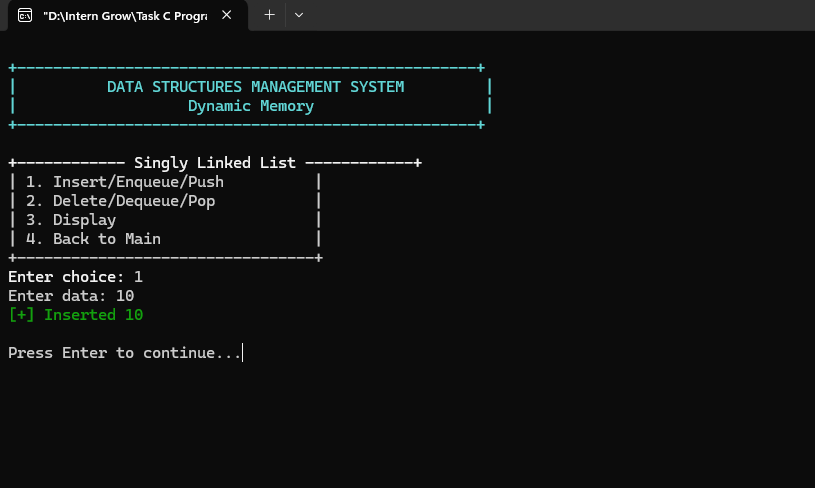

</div>

### Screenshot — Second Insertion

<div align="center">

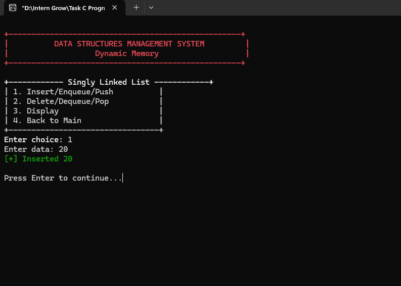

</div>

### Screenshot — Deletion

<div align="center">

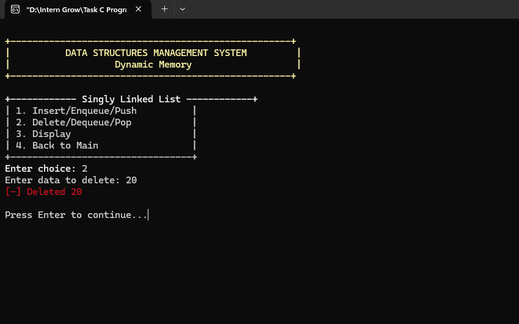

</div>

### Screenshot — Display

<div align="center">

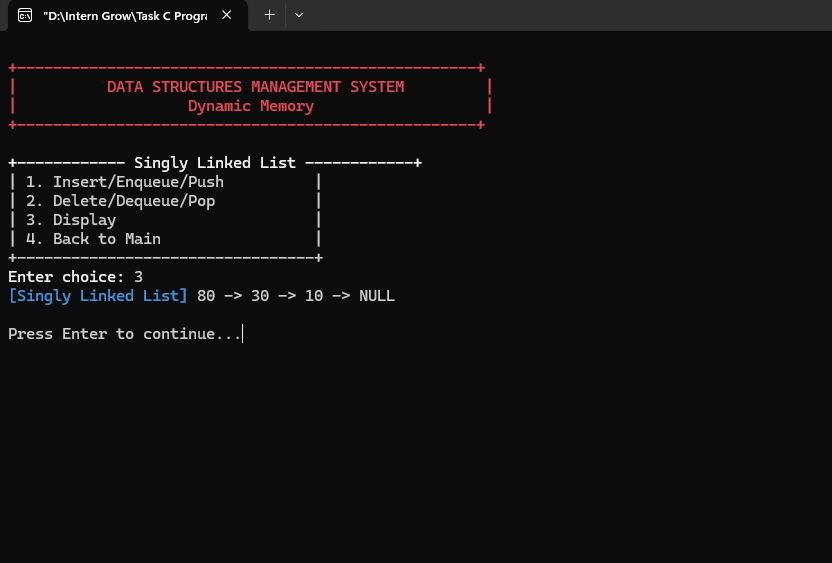

</div>

---

# 2️⃣ Doubly Linked List

The project also implements an upgraded **Doubly Linked List**.

Unlike a singly linked list, each node contains two pointers:

```text
+---------+---------+---------+
|  prev   |  data   |  next   |
+---------+---------+---------+
```

The `prev` pointer points to the previous node while `next` points to the next node.

### Structure

```c
typedef struct DNode {
    int data;
    struct DNode* prev;
    struct DNode* next;
} DNode;
```

The program maintains both:

```c
DNode* dHead = NULL;
DNode* dTail = NULL;
```

This makes it possible to keep track of both ends of the list.

### Supported Operations

* Insert
* Delete by value
* Display
* Free all nodes

### Screenshot — Insertion

<div align="center">

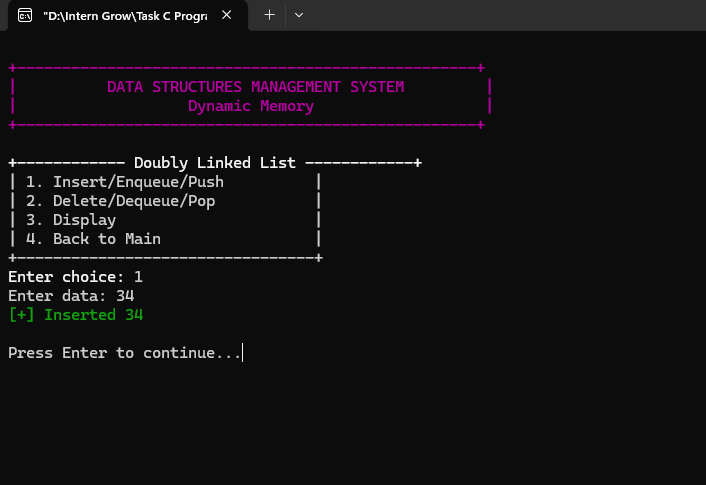

</div>

### Screenshot — Display

<div align="center">

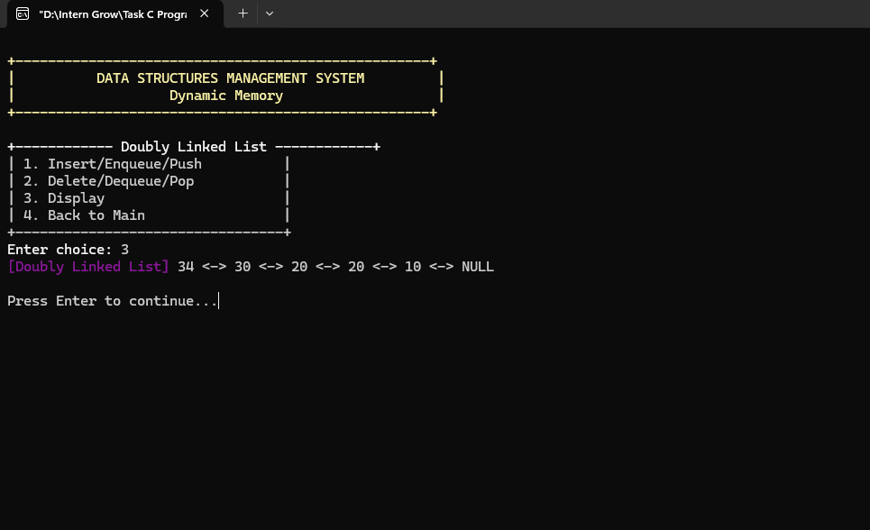

</div>

---

# 3️⃣ Stack

The stack is implemented using dynamically allocated linked-list nodes.

A stack follows the:

```text
LIFO
Last In — First Out
```

principle.

### Main Operations

| Operation | Description                       |
| --------- | --------------------------------- |
| Push      | Adds an element to the top        |
| Pop       | Removes the top element           |
| Display   | Shows elements from top to bottom |

The stack maintains:

```c
StackNode* stackTop = NULL;
```

### Push

A new node is dynamically allocated and placed at the top:

```c
StackNode* newNode = (StackNode*)malloc(sizeof(StackNode));
```

### Pop

The top node is removed and released:

```c
free(temp);
```

### Example

```text
[Stack] Top -> 7 -> 5 -> 4 -> 4 -> 5 -> Bottom
```

### Screenshot — Stack Menu

<div align="center">

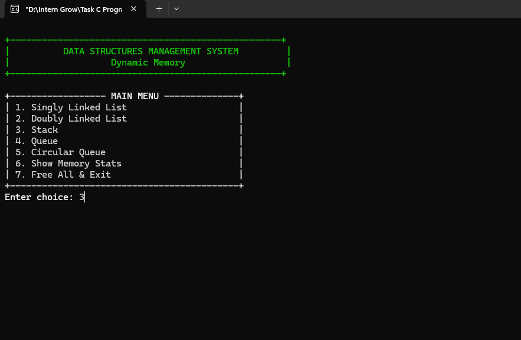

</div>

### Screenshot — Stack Display

<div align="center">

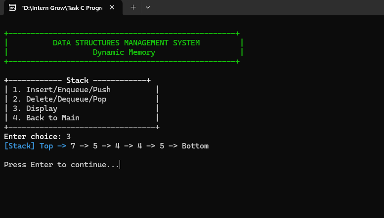

</div>

### Screenshot — Stack Pop

<div align="center">

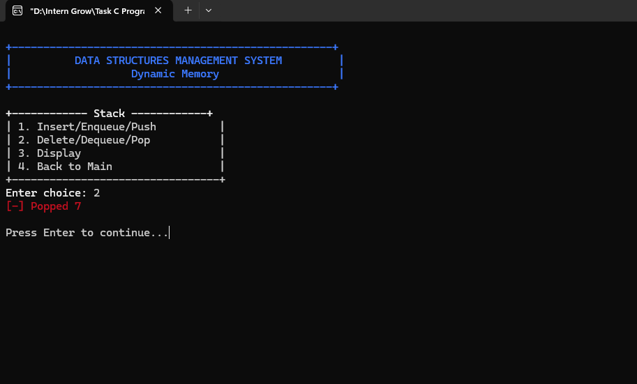

</div>

---

# 4️⃣ Queue

The queue is implemented using dynamically allocated linked-list nodes.

A queue follows the:

```text
FIFO
First In — First Out
```

principle.

The implementation maintains two pointers:

```c
QNode* qFront = NULL;
QNode* qRear = NULL;
```

### Enqueue

New elements are added at the rear.

### Dequeue

Elements are removed from the front.

### Display

The queue is displayed from front to rear.

### Example

```text
[Queue] Front -> 34 -> 56 -> 34 -> 33 -> 33 -> Rear
```

### Screenshot — Enqueue

<div align="center">

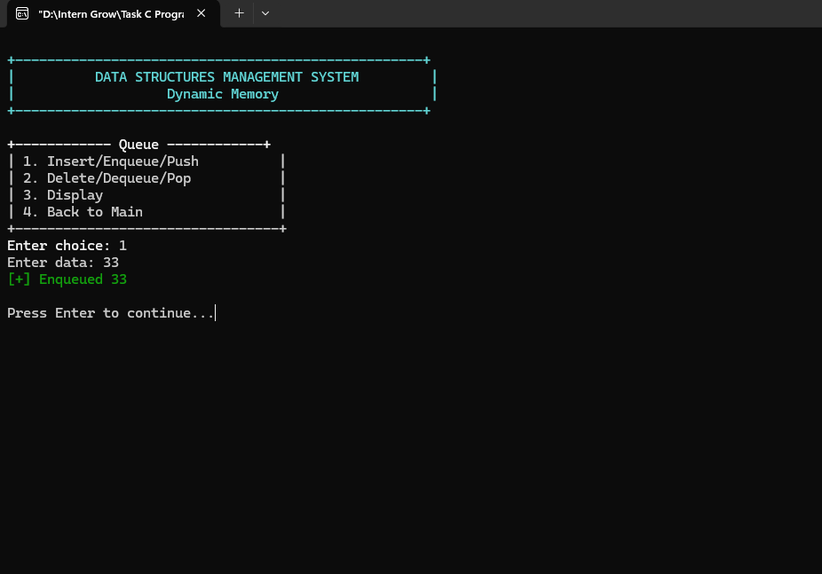

</div>

### Screenshot — Display

<div align="center">

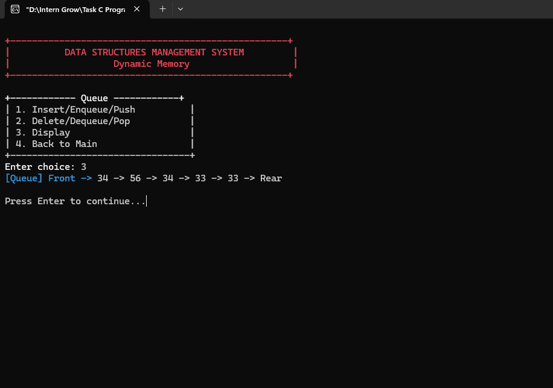

</div>

### Screenshot — Dequeue

<div align="center">

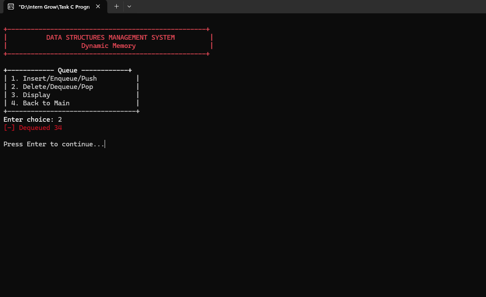

</div>

---

# 5️⃣ Circular Queue

As an upgrade feature, the project includes a **Circular Queue**.

The circular queue uses a fixed-size array:

```c
#define MAX 5
int cq[MAX];
```

The queue uses:

```c
int cqFront = -1;
int cqRear = -1;
```

to track its current state.

### Circular Behavior

When the rear reaches the end of the array, it can wrap around to the beginning.

The implementation uses:

```c
i = (i + 1) % MAX;
```

for circular traversal.

### Capacity

The current implementation supports a maximum of:

```text
5 elements
```

### Supported Operations

* Enqueue
* Dequeue
* Display
* Full queue detection
* Empty queue detection
* Circular wrap-around

### Screenshot — Dequeue

<div align="center">

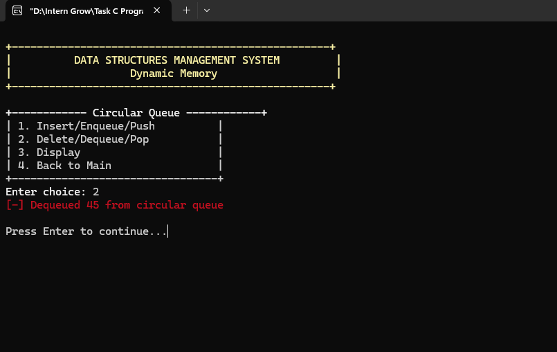

</div>

### Screenshot — Display

<div align="center">

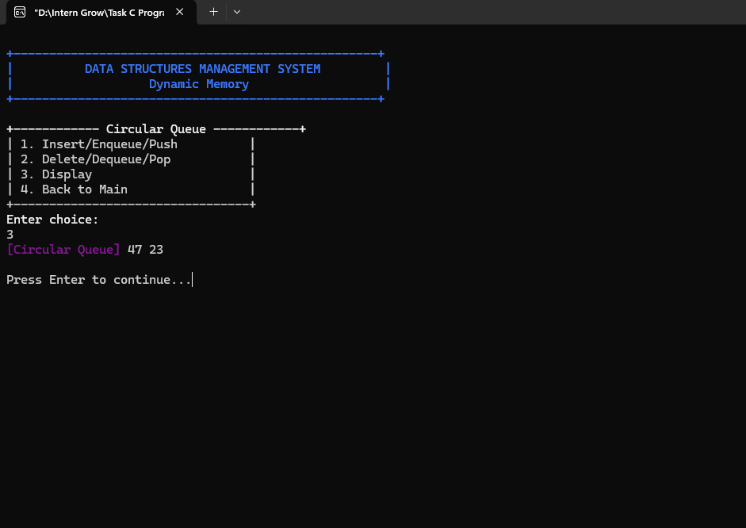

</div>

---

# 🧠 Dynamic Memory Management

Dynamic memory allocation is one of the core concepts demonstrated by this project.

The linked-list-based structures allocate nodes at runtime instead of using a fixed-size array.

The main allocation function used is:

```c
malloc()
```

Memory is released using:

```c
free()
```

---

## `malloc()`

`malloc()` dynamically allocates memory from the heap.

Example from the project:

```c
SNode* newNode = (SNode*)malloc(sizeof(SNode));
```

Similar dynamic allocations are used for:

* Singly Linked List nodes
* Doubly Linked List nodes
* Stack nodes
* Queue nodes

---

## `free()`

Every dynamically allocated node is eventually released using `free()`.

Examples include:

```c
free(temp);
```

and complete cleanup functions such as:

```c
void sFree()
void dFree()
void stackFree()
void queueFree()
```

These functions traverse their respective structures and release every remaining node.

---

# ⚠️ Important Memory Allocation Note

The current implementation uses:

```text
malloc()
free()
```

It does **not currently use**:

```text
calloc()
realloc()
```

Therefore, `calloc()` and `realloc()` should not be listed as implemented features for this exact version of the project.

The circular queue also uses a fixed-size array:

```c
int cq[MAX];
```

rather than dynamically allocated memory.

This README intentionally documents the implementation exactly as written in `main.c`.

---

# 🛡️ Memory Leak Prevention

Memory leak prevention is handled through dedicated cleanup functions.

## Singly Linked List

```c
void sFree()
```

Traverses the list and frees every node.

## Doubly Linked List

```c
void dFree()
```

Releases all nodes and resets:

```c
dTail = NULL;
```

## Stack

```c
void stackFree()
```

Removes and frees every remaining stack node.

## Queue

```c
void queueFree()
```

Releases all queue nodes and resets:

```c
qRear = NULL;
```

## Exit Cleanup

When the user selects:

```text
7. Free All & Exit
```

the program executes:

```c
sFree();
dFree();
stackFree();
queueFree();
```

and then terminates.

This ensures that dynamically allocated nodes remaining in these structures are released before the program exits.

---

# 📊 Memory Management Statistics

The application contains a dedicated memory statistics screen.

The program reports:

```text
=== MEMORY MANAGEMENT STATS ===
Using dynamic memory allocation (malloc/free)
All structures use heap memory
Each structure has its own free function
No memory leaks - all allocations tracked
```

### Screenshot

<div align="center">

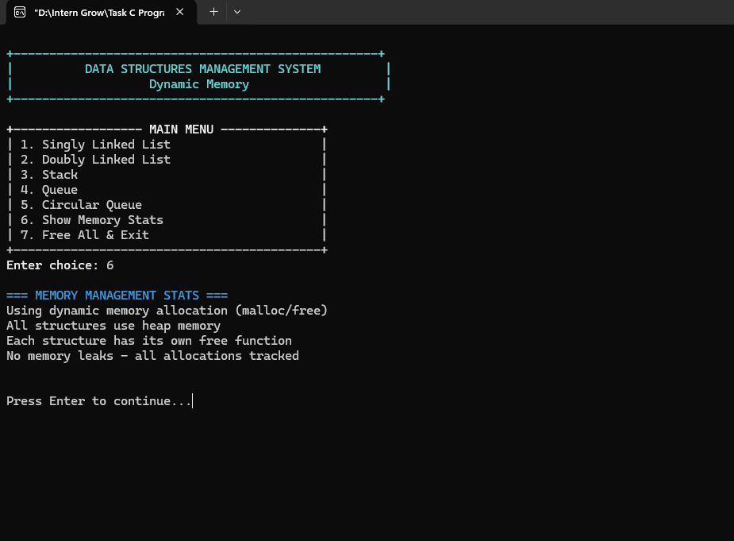

</div>

> **Implementation note:** The statistics screen is informational. The program does not maintain a numerical allocation counter or external memory-tracking table. The memory cleanup is performed through the dedicated `free` functions.

---

# 🎨 Menu-Driven Interface

The entire application is controlled through a menu-driven console interface.

## Main Menu

```text
+------------------ MAIN MENU --------------+
| 1. Singly Linked List                     |
| 2. Doubly Linked List                     |
| 3. Stack                                  |
| 4. Queue                                  |
| 5. Circular Queue                         |
| 6. Show Memory Stats                      |
| 7. Free All & Exit                        |
+-------------------------------------------+
```

The program uses separate submenus for each data structure.

For example:

```text
+------------ Stack ------------+
| 1. Insert/Enqueue/Push        |
| 2. Delete/Dequeue/Pop         |
| 3. Display                    |
| 4. Back to Main               |
+-------------------------------+
```

---

# 🖥️ Program Interface

The application uses ANSI color escape sequences to improve terminal readability.

Color macros are defined at the beginning of the program:

```c
#define RED     "\033[31m"
#define GREEN   "\033[32m"
#define YELLOW  "\033[33m"
#define BLUE    "\033[34m"
#define MAGENTA "\033[35m"
#define CYAN    "\033[36m"
#define WHITE   "\033[37m"
#define BOLD    "\033[1m"
#define RESET   "\033[0m"
```

Different operations use different colors:

* 🟢 Green → successful insertion / enqueue / push
* 🔴 Red → deletion / dequeue / pop
* 🟡 Yellow → warnings and empty/not-found conditions
* 🔵 Cyan → list and queue display
* 🟣 Magenta → doubly linked list and circular queue display

---

# 🧭 Application Flow

The overall program flow is:

```text
                    ┌─────────────────────┐
                    │       START         │
                    └──────────┬──────────┘
                               │
                               ▼
                    ┌─────────────────────┐
                    │     MAIN MENU       │
                    └──────────┬──────────┘
                               │
          ┌────────────┬───────┼────────┬──────────────┐
          ▼            ▼       ▼        ▼              ▼
       Singly       Doubly   Stack    Queue      Circular Queue
       List         List
          │            │       │        │              │
          └────────────┴───────┴────────┴──────────────┘
                               │
                               ▼
                    ┌─────────────────────┐
                    │  Memory Statistics  │
                    └──────────┬──────────┘
                               │
                               ▼
                    ┌─────────────────────┐
                    │  Free All & Exit    │
                    └──────────┬──────────┘
                               │
                               ▼
                    ┌─────────────────────┐
                    │        END          │
                    └─────────────────────┘
```

---

# 📸 Complete Execution Screenshots

The following screenshots document the complete execution flow of the application.

---

## 01 — Main Menu

<div align="center">

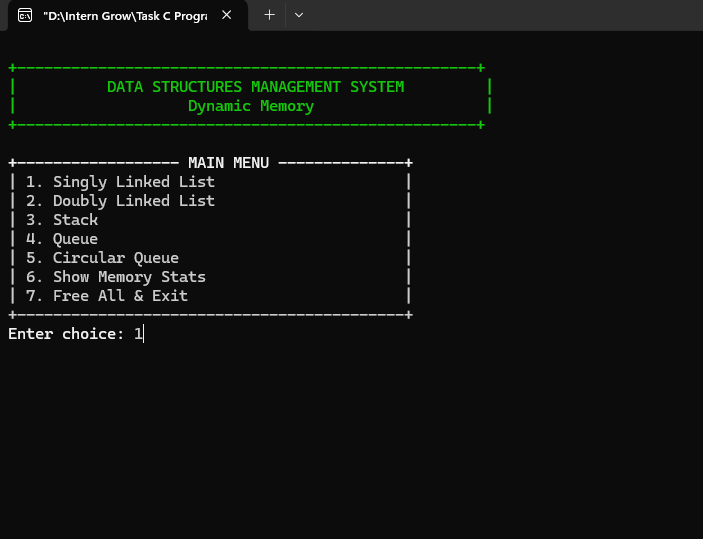

</div>

The main menu provides access to all implemented data structures and memory management options.

---

## 02 — Singly Linked List: Insert 10

<div align="center">


</div>

A new node containing `10` is dynamically allocated and inserted into the singly linked list.

---

## 03 — Singly Linked List: Insert 20

<div align="center">


</div>

Another dynamically allocated node containing `20` is inserted.

---

## 04 — Singly Linked List: Delete 20

<div align="center">


</div>

The program searches for `20`, removes the matching node, reconnects the list, and frees its memory.

---

## 05 — Singly Linked List: Display

<div align="center">


</div>

The current nodes are displayed using the linked-list traversal operation.

---

## 06 — Doubly Linked List: Insert 34

<div align="center">


</div>

A new doubly linked list node is created with both `prev` and `next` pointers.

---

## 07 — Doubly Linked List: Display

<div align="center">


</div>

The doubly linked list is displayed using the `<->` relationship between nodes.

---

## 08 — Stack Menu

<div align="center">


</div>

The stack submenu provides push, pop, display, and back operations.

---

## 09 — Stack Display

<div align="center">


</div>

The stack is displayed from the top node toward the bottom.

---

## 10 — Stack Pop

<div align="center">


</div>

The top element `7` is removed and its dynamically allocated node is released.

---

## 11 — Queue Enqueue 33

<div align="center">


</div>

The value `33` is dynamically added to the rear of the queue.

---

## 12 — Queue Display

<div align="center">


</div>

The queue is displayed from the front toward the rear.

---

## 13 — Queue Dequeue 34

<div align="center">


</div>

The front element `34` is removed and its allocated memory is freed.

---

## 14 — Circular Queue Dequeue 45

<div align="center">


</div>

The circular queue removes the front element while maintaining circular indexing.

---

## 15 — Circular Queue Display

<div align="center">


</div>

The circular queue is traversed using modulo-based circular indexing.

---

## 16 — Memory Management Statistics

<div align="center">


</div>

The application provides a dedicated memory-management information screen.

---

## 17 — Free All & Exit

<div align="center">

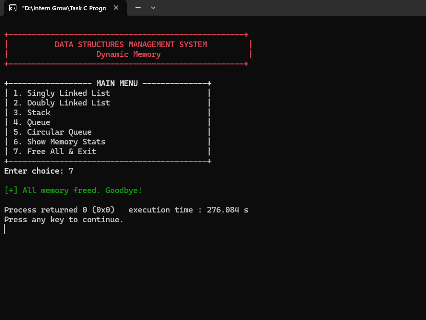

</div>

The final step releases the remaining dynamically allocated memory before the application terminates.

---

# 🔍 Function Reference

## Singly Linked List

| Function     | Purpose                                |
| ------------ | -------------------------------------- |
| `sInsert()`  | Dynamically creates and inserts a node |
| `sDelete()`  | Searches and deletes a node            |
| `sDisplay()` | Traverses and displays the list        |
| `sFree()`    | Frees all remaining nodes              |

---

## Doubly Linked List

| Function     | Purpose                                  |
| ------------ | ---------------------------------------- |
| `dInsert()`  | Creates and inserts a doubly linked node |
| `dDelete()`  | Deletes a matching node                  |
| `dDisplay()` | Displays the doubly linked list          |
| `dFree()`    | Releases all remaining nodes             |

---

## Stack

| Function         | Purpose                  |
| ---------------- | ------------------------ |
| `push()`         | Adds a node to the top   |
| `pop()`          | Removes the top node     |
| `stackDisplay()` | Displays the stack       |
| `stackFree()`    | Releases all stack nodes |

---

## Queue

| Function         | Purpose                       |
| ---------------- | ----------------------------- |
| `enqueue()`      | Adds a node at the rear       |
| `dequeue()`      | Removes a node from the front |
| `queueDisplay()` | Displays the queue            |
| `queueFree()`    | Releases all queue nodes      |

---

## Circular Queue

| Function     | Purpose                                    |
| ------------ | ------------------------------------------ |
| `cEnqueue()` | Adds an element using circular indexing    |
| `cDequeue()` | Removes the front element                  |
| `cDisplay()` | Displays elements using circular traversal |

---

## Interface & Utility Functions

| Function            | Purpose                                |
| ------------------- | -------------------------------------- |
| `clearScreen()`     | Clears the terminal screen             |
| `printHeader()`     | Displays the application header        |
| `printMenu()`       | Displays the main menu                 |
| `printSubMenu()`    | Displays a structure-specific submenu  |
| `showMemoryStats()` | Displays memory-management information |

---

# ⚙️ Technical Implementation

## Pointer Usage

Pointers are fundamental to the linked-list implementations.

For example:

```c
SNode* sHead = NULL;
```

and:

```c
SNode* newNode;
```

Pointers allow nodes to be dynamically connected in memory.

---

## Heap Allocation

The project dynamically creates linked-list nodes:

```c
malloc(sizeof(SNode))
```

```c
malloc(sizeof(DNode))
```

```c
malloc(sizeof(StackNode))
```

```c
malloc(sizeof(QNode))
```

These allocations occur at runtime.

---

## Memory Release

Allocated nodes are released using:

```c
free(temp);
```

Each data structure has its own cleanup function.

---

# ⏱️ Time Complexity

| Operation       | Singly Linked List | Doubly Linked List | Stack | Queue | Circular Queue |
| --------------- | -----------------: | -----------------: | ----: | ----: | -------------: |
| Insert / Push   |               O(1) |               O(1) |  O(1) |  O(1) |           O(1) |
| Delete by Value |               O(n) |               O(n) |  O(1) |  O(1) |           O(1) |
| Display         |               O(n) |               O(n) |  O(n) |  O(n) |           O(n) |
| Free All        |               O(n) |               O(n) |  O(n) |  O(n) |           O(1) |

### Important Note

The linked-list insert operations are `O(1)` because the implementation inserts at the head.

The queue enqueue operation is also `O(1)` because the program maintains a rear pointer.

---

# 💾 Space Complexity

For linked-list-based structures:

```text
O(n)
```

because each stored element requires a dynamically allocated node.

The circular queue has a fixed capacity:

```text
MAX = 5
```

so its storage requirement is:

```text
O(MAX)
```

which is effectively constant for the current implementation.

---

# 🧪 Error Handling

The application checks several invalid states.

### Empty Singly Linked List

```text
[!] List is empty
```

### Missing Singly/Doubly Linked List Value

```text
[!] value not found
```

### Empty Stack

```text
[!] Stack empty
```

### Empty Queue

```text
[!] Queue empty
```

### Empty Circular Queue

```text
[!] Circular Queue is empty
```

### Full Circular Queue

```text
[!] Circular Queue is full
```

These checks prevent invalid removal and traversal operations.

---

# 🔄 Program Control Flow

The program continuously displays the main menu using:

```c
while (1)
```

The user can repeatedly access any structure.

For each selected structure, a second loop displays its submenu.

The user can return to the main menu using:

```text
4. Back to Main
```

The program terminates only when:

```text
7. Free All & Exit
```

is selected.

---

# 🧹 Final Memory Cleanup

Before termination, the program executes:

```c
sFree();
dFree();
stackFree();
queueFree();
```

This releases remaining dynamically allocated nodes from:

* Singly Linked List
* Doubly Linked List
* Stack
* Queue

The circular queue does not require `free()` because its current implementation uses the fixed-size array:

```c
int cq[MAX];
```

---

# 🛠️ Technologies Used

<div align="center">

| Technology            | Usage                               |
| --------------------- | ----------------------------------- |
| **C**                 | Core programming language           |
| **Pointers**          | Dynamic data structure manipulation |
| **`malloc()`**        | Runtime heap allocation             |
| **`free()`**          | Memory deallocation                 |
| **Structures**        | Node definitions                    |
| **Linked Lists**      | Dynamic linear data structures      |
| **Stack**             | LIFO data structure                 |
| **Queue**             | FIFO data structure                 |
| **Circular Queue**    | Circular array-based queue          |
| **ANSI Escape Codes** | Terminal colors                     |
| **Standard Library**  | Input/output and utility functions  |

</div>

---

# ▶️ How to Run

## 1. Clone the Repository

```bash
git clone https://github.com/mahnoor-yasir/InternGrow_Internship.git
```

## 2. Navigate to Task 4

```bash
cd InternGrow_Internship
cd "Task 4 Memory Management & Data Structures"
```

## 3. Compile the Program

Using GCC:

```bash
gcc main.c -o main
```

## 4. Run the Program

### Windows

```bash
main.exe
```

### Linux / macOS

```bash
./main
```

---

# 🖥️ Windows Compatibility

The application contains platform-specific screen clearing:

```c
#ifdef _WIN32
    system("cls");
#else
    system("clear");
#endif
```

Therefore:

* Windows uses `cls`
* Linux/macOS uses `clear`

The application is primarily demonstrated in a Windows terminal environment.

---

# 🎮 How to Use the Application

### Step 1 — Start the program

The main menu appears.

### Step 2 — Select a data structure

Choose:

```text
1. Singly Linked List
2. Doubly Linked List
3. Stack
4. Queue
5. Circular Queue
```

### Step 3 — Select an operation

Depending on the selected structure:

```text
1. Insert / Enqueue / Push
2. Delete / Dequeue / Pop
3. Display
4. Back to Main
```

### Step 4 — Perform operations

Enter the required data when prompted.

### Step 5 — Return to Main

Choose:

```text
4. Back to Main
```

### Step 6 — View Memory Information

Select:

```text
6. Show Memory Stats
```

### Step 7 — Exit Safely

Select:

```text
7. Free All & Exit
```

The program releases dynamically allocated nodes before terminating.

---

# 📚 Concepts Demonstrated

This project provides practical implementation of the following C programming concepts:

### Pointers

Pointers are used to connect nodes and maintain references to dynamically allocated memory.

### Structures

Structures define custom node types.

### Dynamic Memory

`malloc()` allocates memory during runtime.

### Memory Deallocation

`free()` releases memory after it is no longer required.

### Linked Lists

Nodes are connected through pointers.

### Stack

Demonstrates LIFO behavior.

### Queue

Demonstrates FIFO behavior.

### Circular Queue

Demonstrates circular indexing and wrap-around.

### Functions

Each major operation is separated into its own function.

### Conditional Logic

The menu system uses `switch` and conditional statements.

### Loops

Loops are used for:

* Menu repetition
* Linked-list traversal
* Memory cleanup
* Circular queue traversal

---

# 🌟 Upgrade Features

The original task identifies the following upgrades:

* Doubly Linked List
* Circular Queue
* Menu-Driven Implementation

This implementation includes all three.

### ✅ Doubly Linked List

Implemented using:

```c
prev
next
```

pointers.

### ✅ Circular Queue

Implemented using a fixed-size array with circular indexing.

### ✅ Menu-Driven System

Implemented with a main menu and separate submenus for each structure.

---

# 📋 Task Requirement Mapping

| Task Requirement           | Implementation                 |
| -------------------------- | ------------------------------ |
| Singly Linked List         | ✅ `SNode`                      |
| Stack                      | ✅ `StackNode`                  |
| Queue                      | ✅ `QNode`                      |
| Dynamic Memory Allocation  | ✅ `malloc()`                   |
| Memory Leak Prevention     | ✅ Dedicated `free()` functions |
| Doubly Linked List         | ✅ `DNode`                      |
| Circular Queue             | ✅ `cq[MAX]`                    |
| Menu-Driven Implementation | ✅ Main + submenus              |
| Pointers                   | ✅ Extensive pointer usage      |
| Linked Lists               | ✅ Singly + Doubly              |
| Stack                      | ✅ Linked-list implementation   |
| Queue                      | ✅ Linked-list implementation   |

---

# ⚠️ Implementation Scope

This README documents the current version of `main.c` exactly.

### Currently implemented

```text
malloc()
free()
```

### Not currently implemented

```text
calloc()
realloc()
```

If `calloc()` and `realloc()` are required by the internship evaluator as mandatory implementation features rather than concepts to study, they would need to be added to the source code separately.

Similarly, the circular queue currently uses a fixed-size array instead of dynamic allocation.

---

# 🏆 Learning Outcomes

After completing this task, the following concepts are demonstrated through practical implementation:

* Understanding pointer-based memory structures
* Creating nodes dynamically
* Connecting nodes through pointers
* Inserting and deleting linked-list nodes
* Implementing LIFO behavior
* Implementing FIFO behavior
* Implementing circular queue logic
* Managing heap memory
* Releasing allocated memory
* Designing menu-driven console applications
* Organizing data structure operations into functions
* Handling empty and full data-structure states
* Applying basic time and space complexity concepts

---

# 🔐 Memory Safety Practices

The implementation follows several basic memory-management practices:

* Nodes are dynamically allocated only when required.
* Removed nodes are released with `free()`.
* Each linked structure has a dedicated cleanup function.
* Remaining nodes are freed before normal program termination.
* Head and tail pointers are reset where required.
* Empty-state checks are performed before removal operations.

---

# 📸 Project Demonstration

<div align="center">

### Main Interface


<br><br>

### Singly Linked List


<br><br>

### Doubly Linked List


<br><br>

### Stack


<br><br>

### Queue


<br><br>

### Circular Queue


<br><br>

### Memory Management


<br><br>

### Final Memory Cleanup


</div>

---

# 📁 Repository Structure

```text
InternGrow_Internship/
│
└── Task 4 Memory Management & Data Structures/
    │
    ├── main.c
    ├── README.md
    │
    └── images/
        │
        ├── .gitkeep
        ├── 01_Main_Menu.png
        ├── 02_Singly_Linked_List_Insert_10.png
        ├── 03_Singly_Linked_List_Insert_20.png
        ├── 04_Singly_Linked_List_Delete_20.png
        ├── 05_Singly_Linked_List_Display.png
        ├── 06_Doubly_Linked_List_Insert_34.png
        ├── 07_Doubly_Linked_List_Display.png
        ├── 08_Stack_Menu.png
        ├── 09_Stack_Display.png
        ├── 10_Stack_Pop_7.png
        ├── 11_Queue_Enqueue_33.png
        ├── 12_Queue_Display.png
        ├── 13_Queue_Dequeue_34.png
        ├── 14_Circular_Queue_Dequeued_45.png
        ├── 15_Circular_Queue_Display.png
        ├── 16_Memory_Management_Stats.png
        └── 17_Free_All_Exit.png
```

---

# 🚀 Project Highlights

<div align="center">

### 🧠 Data Structures

**Singly Linked List • Doubly Linked List • Stack • Queue • Circular Queue**

### 💾 Memory

**Dynamic Allocation • Heap Memory • `malloc()` • `free()`**

### 🎮 Interface

**Menu Driven • Interactive • Colored Terminal • Error Handling**

### 🛡️ Cleanup

**Structure-Specific Free Functions • Final Memory Cleanup**

</div>

---

# 📌 Project Status

<div align="center">

## ✅ COMPLETED

### Task 4 — Memory Management & Data Structures

**Week 4**

<br>

**Implemented in C**

**Menu-Driven Console Application**

**Dynamic Linked Data Structures**

**Memory Cleanup**

**Doubly Linked List Upgrade**

**Circular Queue Upgrade**

</div>

---

# 👩‍💻 Author

<div align="center">

### Mahnoor Yasir

**Computer Science Student | C Programming Intern**

<br>

Developed as part of the **InternGrow C Programming Internship — Task 4**

</div>

---

# ⭐ Conclusion

The **Data Structures Management System** provides a practical implementation of fundamental data structures in C while focusing on pointers, dynamic memory allocation, node manipulation, and memory cleanup.

The project combines standard data structures with an interactive menu-driven interface and demonstrates how dynamically allocated nodes can be created, connected, manipulated, displayed, and safely released.

The implementation also extends the core requirements with a **Doubly Linked List**, **Circular Queue**, and dedicated cleanup functions, providing a broader practical demonstration of memory management and data-structure operations in C.

---

<div align="center">

## 💻 Built with C

### Pointers • Dynamic Memory • Linked Lists • Stack • Queue • Circular Queue

**Task 4 — Week 4**

</div>


