# 📇 Contact Management System — Advanced C Project

<p align="center">
  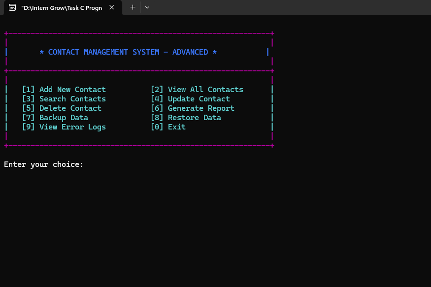
</p>

<h1 align="center">📇 Contact Management System</h1>

<p align="center">
  <b>A Feature-Rich Console-Based Contact Management Application in C</b>
</p>

<p align="center">
  
  
  
  
  
</p>

<p align="center">
  <b>InternGrow Internship — Task 5: Mini System Utility</b>
</p>

---

## 📌 Project Overview

The **Contact Management System** is a menu-driven console application developed in the **C programming language**.

It is designed as a practical mini system utility for creating, storing, searching, updating, deleting, backing up, restoring, and reporting contact information.

The application uses a **singly linked list** as its primary in-memory data structure. Each contact is dynamically allocated using `malloc()` and released using `free()`.

The system also provides persistent storage through a text file so that contact information can be loaded again when the program starts.

### Core Capabilities

* ➕ Add new contacts
* 👥 View all contacts
* 🔎 Search contacts
* ✏️ Update contact information
* 🗑️ Delete contacts
* 📊 Generate contact reports
* 💾 Backup contact data
* ♻️ Restore contact data
* 🚨 View error logs
* 💿 Save and load contact data
* 🧠 Dynamic memory management
* 🎨 Colored console interface
* ✅ Phone and email validation
* 🔤 Case-insensitive searching

---

# 🎯 Project Objective

The main objective of this project is to build a practical **C-based system utility** while demonstrating fundamental and intermediate programming concepts.

The implementation focuses on:

```text
Data Structures
Dynamic Memory Allocation
Pointers
Singly Linked Lists
Structures
Functions
File Handling
String Manipulation
Input Validation
Searching
Updating
Deleting
Backup & Restore
Report Generation
Error Logging
Console UI
```

The project combines these concepts into one complete command-line application.

---

# ✨ Feature Highlights

<table>
<tr>
<td width="50%" valign="top">

## 👤 Contact Management

* Add new contact
* View all contacts
* Search contacts
* Update contact
* Delete contact
* Automatic contact IDs

</td>

<td width="50%" valign="top">

## 💾 Data Management

* Persistent contact storage
* Backup data
* Restore data
* Report generation
* Error logging
* Automatic data saving

</td>
</tr>

<tr>
<td width="50%" valign="top">

## 🔎 Smart Search

Search contacts by:

* Name
* Phone
* Email
* Category

Search is case-insensitive.

</td>

<td width="50%" valign="top">

## 🛡️ Validation

The system validates:

* Phone numbers
* Email addresses
* Menu choices
* Search options
* Contact IDs
* Update fields
* Delete confirmations

</td>
</tr>
</table>

---

# 🧭 Main Menu

The application provides a simple numbered menu:

```text
+-----------------------------------------------------------+
|                                                           |
|               CONTACT MANAGEMENT SYSTEM                   |
|                                                           |
+-----------------------------------------------------------+
|                                                           |
|   [1] Add New Contact          [2] View All Contacts      |
|   [3] Search Contacts          [4] Update Contact         |
|   [5] Delete Contact           [6] Generate Report        |
|   [7] Backup Data              [8] Restore Data           |
|   [9] View Error Logs          [0] Exit                   |
|                                                           |
+-----------------------------------------------------------+

Enter your choice:
```

### Available Operations

| Option | Operation         | Description                               |
| :----: | ----------------- | ----------------------------------------- |
|   `1`  | Add New Contact   | Create and save a new contact             |
|   `2`  | View All Contacts | Display all stored contacts               |
|   `3`  | Search Contacts   | Search by name, phone, email, or category |
|   `4`  | Update Contact    | Modify any contact field                  |
|   `5`  | Delete Contact    | Remove a contact after confirmation       |
|   `6`  | Generate Report   | Create a contact statistics report        |
|   `7`  | Backup Data       | Create a copy of the contact data         |
|   `8`  | Restore Data      | Restore data from the backup              |
|   `9`  | View Error Logs   | Display recorded system errors            |
|   `0`  | Exit              | Save data, release memory, and close      |

The menu is controlled through a `switch` statement in `main()` and continues until the user selects `0`.

---

# 🧱 Data Structure Design

The project uses two structures.

## 1. Contact Structure

```c
typedef struct Contact {
    int id;
    char firstName[50];
    char lastName[50];
    char phone[20];
    char email[100];
    char address[200];
    char category[30];
    char birthday[20];
    char notes[200];
    struct Contact* next;
} Contact;
```

Each contact stores:

| Field       | Purpose                         |
| ----------- | ------------------------------- |
| `id`        | Unique contact ID               |
| `firstName` | Contact's first name            |
| `lastName`  | Contact's last name             |
| `phone`     | Phone number                    |
| `email`     | Email address                   |
| `address`   | Physical address                |
| `category`  | Family, Friend, Work, or Other  |
| `birthday`  | Birthday in `DD/MM/YYYY` format |
| `notes`     | Additional information          |
| `next`      | Pointer to the next contact     |

The `next` pointer makes the structure suitable for a **singly linked list**.

---

# 🗂️ Contact Manager Structure

The complete contact list is managed using:

```c
typedef struct {
    Contact* head;
    int totalContacts;
    int nextId;
    char dataFile[100];
    char backupFile[100];
    char logFile[100];
} ContactManager;
```

### Manager Fields

| Field           | Purpose                       |
| --------------- | ----------------------------- |
| `head`          | Points to the first contact   |
| `totalContacts` | Stores the number of contacts |
| `nextId`        | Stores the next contact ID    |
| `dataFile`      | Main contact data file        |
| `backupFile`    | Backup file                   |
| `logFile`       | Error log file                |

The manager is initialized with:

```text
head = NULL
totalContacts = 0
nextId = 1
```

and the application uses:

```text
contacts_data.txt
contacts_backup.txt
error_logs.txt
```

for its main data, backup, and error-log files.

---

# 🔗 Singly Linked List

The contact records are stored dynamically using a **singly linked list**.

Conceptually:

```text
HEAD
 │
 ▼
┌───────────────┐
│ Contact ID: 1 │
│ Mahnoor Yasir │
│      next ──────────┐
└───────────────┘     │
                      ▼
                ┌───────────────┐
                │ Contact ID: 2 │
                │ Another Name  │
                │      next ──────────┐
                └───────────────┘     │
                                      ▼
                                ┌───────────────┐
                                │ Contact ID: 3 │
                                │ Another Name  │
                                │   next = NULL  │
                                └───────────────┘
```

### Why a Linked List?

The project uses dynamic linked-list storage instead of a fixed contact array.

When a new contact is created:

```c
malloc(sizeof(Contact))
```

allocates memory dynamically.

When a contact is deleted:

```c
free(current);
```

releases its memory.

This demonstrates practical use of:

* Pointers
* Dynamic memory allocation
* Linked lists
* Memory deallocation

The implementation also includes a dedicated `freeMemory()` function that walks through the list and releases every node before the application exits.

---

# ➕ 1. Add New Contact

The **Add New Contact** feature creates a new contact dynamically.

### Information Collected

```text
First Name
Last Name
Phone Number
Email Address
Address
Category
Birthday
Notes
```

The application automatically assigns a unique sequential ID.

Example:

```text
Contact ID: 2

First Name: Mahnoor
Last Name: Yasir
Phone Number: 03184328999
Email Address: mahnooryasir@gmail.com
Address: Lahore
Category: Friend
Birthday: 09/09/2008
Notes: Met at college
```

After successful insertion:

```text
[SUCCESS] Contact added successfully! (ID: 2)
```

The new contact is appended to the linked list and the data file is immediately updated.

---

## 📸 Add Contact — Actual Application

<table>
<tr>
<td align="center">

### 02 — Add New Contact

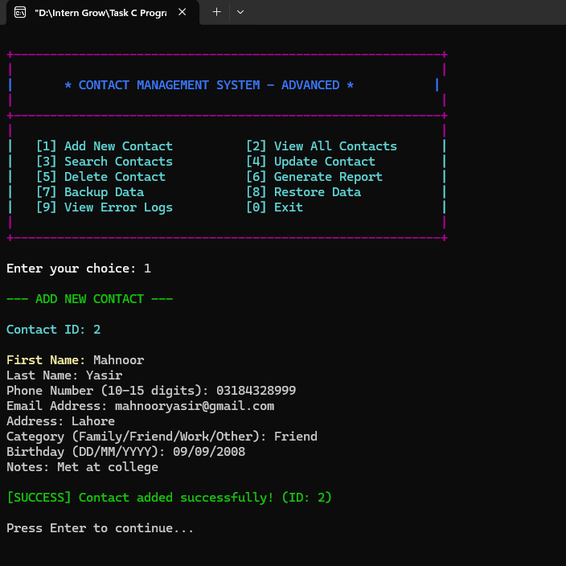

<br>

<b>Contact creation form with validated contact information.</b>

</td>
</tr>
</table>

---

# 👥 2. View All Contacts

The **View All Contacts** feature traverses the linked list from `head` to the final node.

Each contact is displayed in a formatted card:

```text
+-------------------------------------------------+
| ID: 2     | Name: Mahnoor Yasir
| Phone: 03184328999 | Email: mahnooryasir@gmail.com
| Category: Friend | Birthday: 09/09/2008
| Address: Lahore
| Notes: Met at college
+-------------------------------------------------+
```

The application also displays:

```text
Total Contacts: X
```

### Pagination

For larger contact lists, the program pauses after every five contacts:

```text
Press Enter to see more contacts...
```

This prevents a large number of contact cards from flooding the terminal.

---

## 📸 View Contacts — Menu Stage

<table>
<tr>
<td align="center">

### 03 — Menu / Selection Stage

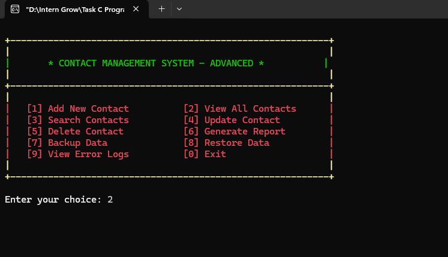

<br>

<b>Menu selection before viewing stored contacts.</b>

</td>
</tr>
</table>

---

## 📸 View Contacts — Results

<table>
<tr>
<td align="center">

### 04 — All Contacts

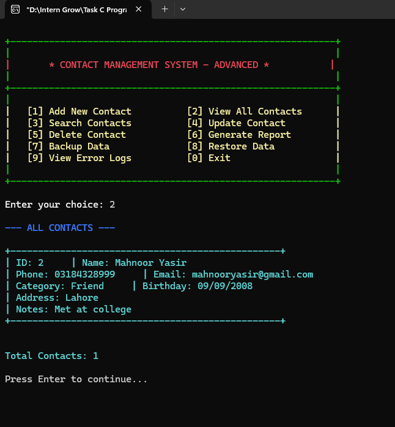

<br>

<b>All stored contacts displayed as formatted contact cards.</b>

</td>
</tr>
</table>

---

# 🔎 3. Search Contacts

The search feature provides four search modes:

```text
1. Name
2. Phone
3. Email
4. Category
```

The program converts both the search term and relevant contact fields to lowercase before comparing them.

This allows searches such as:

```text
mahnoor
Mahnoor
MAHNOOR
```

to match the same contact.

The search uses substring matching through:

```c
strstr()
```

### Example

```text
Search by:
1. Name
2. Phone
3. Email
4. Category

Enter choice: 1
Enter search term: Mahnoor
```

The matching contact is then displayed.

The program reports:

```text
Found 1 contact(s)
```

or:

```text
No contacts found matching '...'
```

The implementation performs case-insensitive matching for names, phone numbers, email addresses, and categories.

---

## 📸 Search Contacts

<table>
<tr>
<td align="center">

### 05 — Search Contact

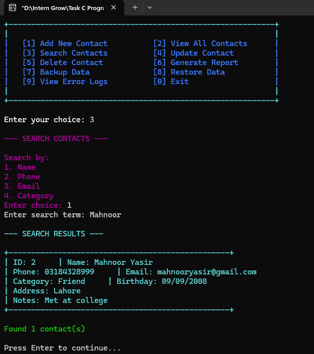

<br>

<b>Case-insensitive contact search with formatted search results.</b>

</td>
</tr>
</table>

---

# ✏️ 4. Update Contact

The update feature first asks for a contact ID.

Example:

```text
Enter contact ID to update: 2
```

The current contact information is displayed before modification.

The user can update any of the following:

```text
1. First Name
2. Last Name
3. Phone
4. Email
5. Address
6. Category
7. Birthday
8. Notes
```

### Update Flow

```text
Contact ID
     │
     ▼
Find Contact
     │
     ▼
Display Current Details
     │
     ▼
Select Field
     │
     ▼
Enter New Value
     │
     ▼
Validate if Required
     │
     ▼
Update Node
     │
     ▼
Save Data
```

Phone and email fields are validated before they are accepted.

After a successful update:

```text
[SUCCESS] Contact updated successfully!
```

The updated record is then saved to the data file.

---

## 📸 Update Contact

<table>
<tr>
<td align="center">

### 06 — Update Contact

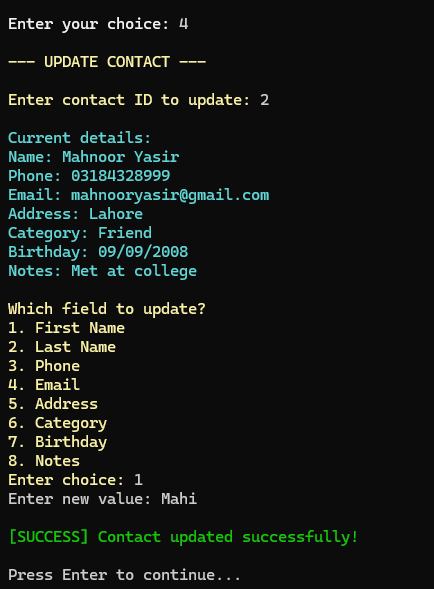

<br>

<b>Existing contact information is displayed before selecting a field to update.</b>

</td>
</tr>
</table>

---

# 📊 5. Generate Report

The **Generate Report** feature analyzes contacts according to their categories.

Supported category groups:

```text
Family
Friend
Work
Other
```

The application counts the contacts in each category and displays a statistics card.

### Example

```text
+-------------------------------------------+
|         CONTACT STATISTICS                 |
+-------------------------------------------+
| Total Contacts: X                         |
|                                           |
| By Category:                              |
|   Family:   X                             |
|   Friend:   X                             |
|   Work:     X                             |
|   Other:    X                             |
+-------------------------------------------+
```

The system also creates:

```text
contact_report.txt
```

The report contains:

* Report generation date
* Total contacts
* Category breakdown
* Complete contact list
* Contact IDs
* Names
* Phone numbers
* Emails
* Categories
* Birthdays
* Addresses
* Notes

The report is written using standard C file handling.

---

## 📸 Generate Report

<table>
<tr>
<td align="center">

### 07 — Generate Report

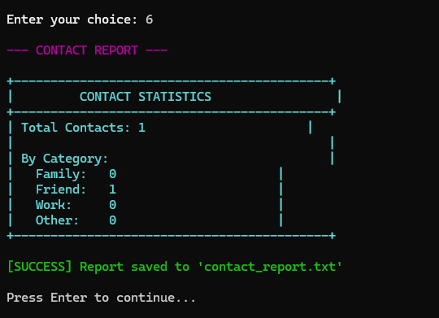

<br>

<b>Contact statistics and report-generation result.</b>

</td>
</tr>
</table>

---

# 💾 6. Backup Data

The backup feature creates a copy of the main contact data.

### Main Data File

```text
contacts_data.txt
```

### Backup File

```text
contacts_backup.txt
```

The backup process:

```text
contacts_data.txt
        │
        ▼
   Read File
        │
        ▼
Copy Contents
        │
        ▼
contacts_backup.txt
```

The application copies the source file character-by-character using:

```c
fgetc()
fputc()
```

After successful completion:

```text
[SUCCESS] Backup created successfully:
contacts_backup.txt
```

If the main data file does not exist, the system reports an appropriate error.

---

## 📸 Backup Data

<table>
<tr>
<td align="center">

### 08 — Backup Data

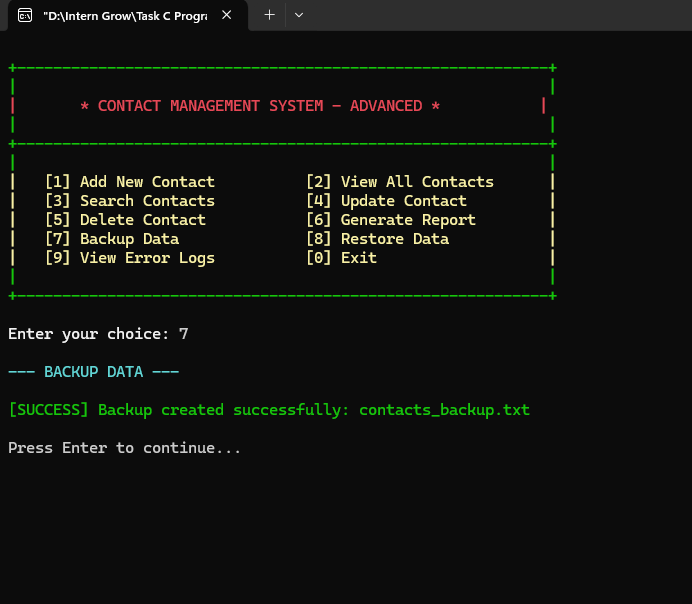

<br>

<b>Contact data backup operation.</b>

</td>
</tr>
</table>

---

# ♻️ 7. Restore Data

The restore feature retrieves the previously created backup.

### Restore Source

```text
contacts_backup.txt
```

### Restore Destination

```text
contacts_data.txt
```

Before restoring, the application asks for confirmation:

```text
Restoring will overwrite current data. Continue? (y/n):
```

If the user confirms, the backup data replaces the current data.

The manager is then reinitialized and the restored records are loaded back into memory.

### Restore Flow

```text
contacts_backup.txt
        │
        ▼
 Confirmation
        │
        ▼
Overwrite contacts_data.txt
        │
        ▼
Free Existing Memory
        │
        ▼
Reload Restored Contacts
        │
        ▼
System Ready
```

This combines file copying with linked-list memory reconstruction.

---

## 📸 Restore Data

<table>
<tr>
<td align="center">

### 09 — Restore Data

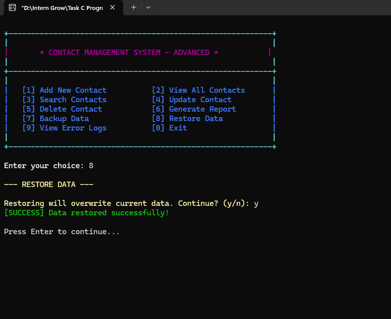

<br>

<b>Restoring contact data from the backup file.</b>

</td>
</tr>
</table>

---

# 🚨 8. View Error Logs

The application maintains an error log file:

```text
error_logs.txt
```

Errors are recorded with a timestamp.

Example format:

```text
[2026-08-21 22:15:30] Memory allocation failed for new contact
```

The `logError()` function uses:

```c
time()
localtime()
fprintf()
```

to store the date and time of each logged error.

The error-log screen reads the file line by line and displays:

```text
Recent error logs:
=================================

1. [timestamp] Error message
2. [timestamp] Error message

Total errors logged: 2
```

If no log file exists:

```text
No error logs found.
```

The implementation uses append mode so new errors can be added without removing earlier entries.

---

## 📸 Error Logs

<table>
<tr>
<td align="center">

### 10 — View Error Logs

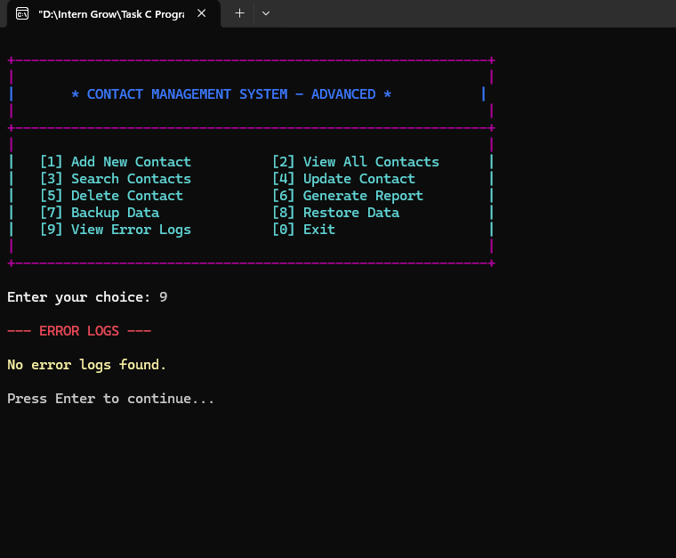

<br>

<b>Timestamped application error log viewer.</b>

</td>
</tr>
</table>

---

# 🗑️ 9. Delete Contact

The delete operation searches for a contact using its ID.

Example:

```text
Enter contact ID to delete: 2
```

Before deleting, the system asks for confirmation:

```text
Are you sure you want to delete contact 'Mahnoor Yasir'? (y/n):
```

If the user chooses:

```text
n
```

the deletion is cancelled.

If the user chooses:

```text
y
```

the node is removed from the linked list and its memory is released using:

```c
free(current);
```

The contact count is also decreased.

### Linked List Deletion

```text
Before:

HEAD
 │
 ▼
[Contact 1] → [Contact 2] → [Contact 3] → NULL


Delete Contact 2:

HEAD
 │
 ▼
[Contact 1] ───────────────→ [Contact 3] → NULL

                    Contact 2
                       ↓
                     free()
```

This demonstrates pointer manipulation and dynamic memory management in C.

---

## 📸 Delete Contact — Cancelled

<table>
<tr>
<td align="center">

### 11 — Delete Contact Cancelled

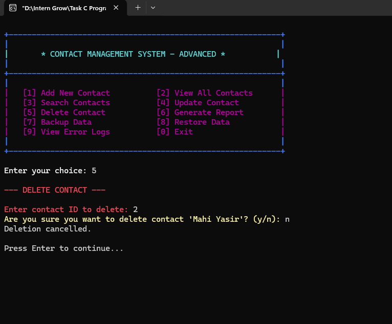

<br>

<b>Deletion confirmation prevents accidental contact removal.</b>

</td>
</tr>
</table>

---

# 💿 Data Persistence

The application stores contact information in:

```text
contacts_data.txt
```

The file is loaded when the program starts:

```c
loadFromFile(&manager);
```

and saved whenever contact information changes.

The program saves data after:

* Adding a contact
* Updating a contact
* Deleting a contact
* Exiting the application

The save operation writes:

```text
Next ID
Total Contacts
Contact ID
First Name
Last Name
Phone
Email
Address
Category
Birthday
Notes
```

for every contact.

---

# 🔄 Load & Save Architecture

```text
                APPLICATION START
                       │
                       ▼
               initializeManager()
                       │
                       ▼
                 loadFromFile()
                       │
                       ▼
              Build Linked List
                       │
                       ▼
                 Main Menu
                       │
        ┌──────────────┼──────────────┐
        │              │              │
        ▼              ▼              ▼
      Add            Update         Delete
        │              │              │
        └──────────────┼──────────────┘
                       ▼
                  saveToFile()
                       │
                       ▼
              contacts_data.txt
                       │
                       ▼
                   Exit
```

---

# 🧠 Input Validation

The project includes dedicated validation functions.

## Phone Validation

```c
int isValidPhone(const char* phone)
```

The current implementation requires:

```text
Minimum length: 10
Maximum length: 15
```

and allows:

```text
Digits
-
+
```

For example:

```text
03184328999
+923184328999
```

are compatible with the validation rules.

---

## Email Validation

```c
int isValidEmail(const char* email)
```

The implementation checks that:

```text
Email length >= 5
Exactly one @ symbol
At least one . character
```

This provides a lightweight validation layer suitable for a console-based educational project.

---

# 🔤 Case-Insensitive Searching

The project contains:

```c
void toLowerCase(char* str)
```

which converts strings to lowercase using:

```c
tolower()
```

Before searching, the input search term and contact fields are converted to lowercase.

This makes search matching independent of capitalization.

Example:

```text
Mahnoor
mahnoor
MAHNOOR
MaHnOoR
```

can all match the same name.

---

# 🎨 Console UI

The application uses a colorful terminal interface.

The program defines several console colors:

```c
COLOR_WHITE
COLOR_BLUE
COLOR_GREEN
COLOR_CYAN
COLOR_RED
COLOR_MAGENTA
COLOR_YELLOW
COLOR_BRIGHT_WHITE
```

On Windows, colors are applied through:

```c
SetConsoleTextAttribute()
```

The application also changes menu, header, and border colors between screens.

This creates a more polished console experience while keeping the project completely text-based.

---

# 🖥️ Cross-Platform Screen Clearing

The source includes platform-specific screen clearing:

```c
#ifdef _WIN32
    #include <windows.h>
    #define CLEAR_SCREEN() system("cls")
#else
    #include <unistd.h>
    #define CLEAR_SCREEN() system("clear")
#endif
```

Therefore, the program includes separate behavior for Windows and non-Windows environments.

The Windows version additionally hides the console cursor while the menu is displayed.

---

# 🧩 Function Architecture

The application is divided into focused functions rather than putting everything inside `main()`.

### Core Functions

```c
initializeManager()
displayMenu()
getChoice()

addContact()
viewAllContacts()
searchContact()
updateContact()
deleteContact()

generateReport()
backupData()
restoreData()
viewErrorLogs()

saveToFile()
loadFromFile()

logError()
freeMemory()
```

### Utility Functions

```c
isValidPhone()
isValidEmail()
toLowerCase()
clearInputBuffer()
displayContact()
displayHeader()
displayDivider()
```

This modular approach makes the source easier to read, maintain, test, and extend. The declared function prototypes and implementations show the complete function-based organization.

---

# 🗂️ Project Structure

```text
InternGrow_Internship/
│
├── Task 5 Mini System Utility/
│   │
│   ├── 📁 images/
│   │   ├── 01_Main_Menu.png
│   │   ├── 02_Add_Contact.png
│   │   ├── 03_Menu_Compact.png
│   │   ├── 04_View_Contacts.png
│   │   ├── 05_Search_Contact.png
│   │   ├── 06_Update_Contact.png
│   │   ├── 07_Generate_Report.png
│   │   ├── 08_Backup_Data.png
│   │   ├── 09_Restore_Data.png
│   │   ├── 10_View_Error_Logs.png
│   │   ├── 11_Delete_Contact_Cancelled.png
│   │   └── 12_Exit_Program.png
│   │
│   ├── 📄 main.c
│   ├── 📄 README.md
│   │
│   ├── 📄 contacts_data.txt
│   ├── 📄 contacts_backup.txt
│   ├── 📄 contact_report.txt
│   └── 📄 error_logs.txt
│
└── README.md
```

### Runtime / Generated Files

| File                  | Purpose                             |
| --------------------- | ----------------------------------- |
| `contacts_data.txt`   | Main persistent contact database    |
| `contacts_backup.txt` | Backup copy of contact data         |
| `contact_report.txt`  | Generated contact statistics/report |
| `error_logs.txt`      | Timestamped application errors      |

The source code explicitly initializes these filenames in `initializeManager()`.

---

# 📸 Complete Application Showcase

Below is the complete screenshot sequence included in this repository.

---

## 🖥️ 01 — Main Menu

<table>
<tr>
<td align="center">


<br><br>

<b>Application home screen and navigation menu.</b>

</td>
</tr>
</table>

---

## 👤 02 — Add Contact

<table>
<tr>
<td align="center">


<br><br>

<b>New contact creation with validation.</b>

</td>
</tr>
</table>

---

## 📋 03 — Menu Compact

<table>
<tr>
<td align="center">


<br><br>

<b>Menu state used during navigation between operations.</b>

</td>
</tr>
</table>

---

## 👥 04 — View Contacts

<table>
<tr>
<td align="center">


<br><br>

<b>Stored contacts displayed in formatted cards.</b>

</td>
</tr>
</table>

---

## 🔎 05 — Search Contact

<table>
<tr>
<td align="center">


<br><br>

<b>Contact search by name, phone, email, or category.</b>

</td>
</tr>
</table>

---

## ✏️ 06 — Update Contact

<table>
<tr>
<td align="center">


<br><br>

<b>Individual contact fields can be updated.</b>

</td>
</tr>
</table>

---

## 📊 07 — Generate Report

<table>
<tr>
<td align="center">


<br><br>

<b>Category statistics and report generation.</b>

</td>
</tr>
</table>

---

## 💾 08 — Backup Data

<table>
<tr>
<td align="center">


<br><br>

<b>Creates a backup copy of the contact database.</b>

</td>
</tr>
</table>

---

## ♻️ 09 — Restore Data

<table>
<tr>
<td align="center">


<br><br>

<b>Restores contact information from the backup file.</b>

</td>
</tr>
</table>

---

## 🚨 10 — View Error Logs

<table>
<tr>
<td align="center">


<br><br>

<b>Displays timestamped application errors.</b>

</td>
</tr>
</table>

---

## 🗑️ 11 — Delete Contact Cancelled

<table>
<tr>
<td align="center">


<br><br>

<b>Deletion confirmation protects against accidental removal.</b>

</td>
</tr>
</table>

---

## 👋 12 — Exit Program

<table>
<tr>
<td align="center">

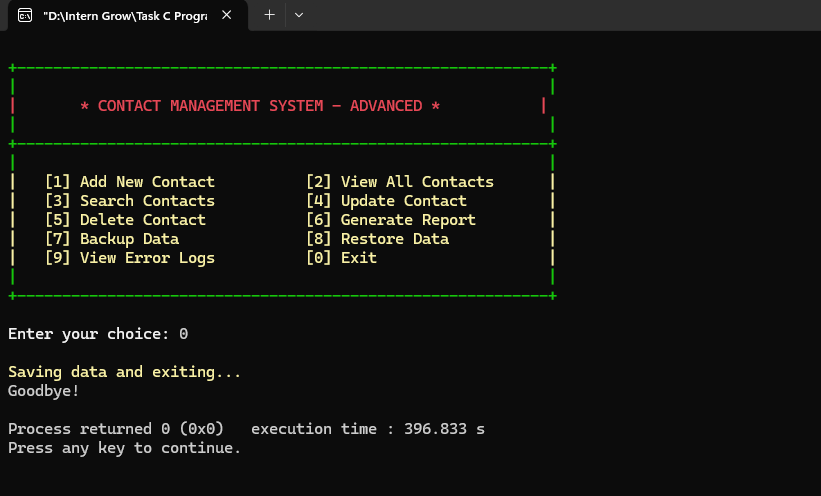

<br><br>

<b>Application saves data, releases memory, and exits cleanly.</b>

</td>
</tr>
</table>

---

# 🔄 Complete System Workflow

```text
                    ┌──────────────────────┐
                    │    Start Program     │
                    └──────────┬───────────┘
                               │
                               ▼
                    ┌──────────────────────┐
                    │ initializeManager()  │
                    └──────────┬───────────┘
                               │
                               ▼
                    ┌──────────────────────┐
                    │    loadFromFile()    │
                    └──────────┬───────────┘
                               │
                               ▼
                    ┌──────────────────────┐
                    │      Main Menu       │
                    └──────────┬───────────┘
                               │
        ┌──────────────┬───────┼────────┬───────────────┐
        │              │       │        │               │
        ▼              ▼       ▼        ▼               ▼
      Add            View    Search   Update          Delete
        │              │       │        │               │
        └──────────────┴───────┴────────┴───────────────┘
                               │
                               ▼
                        Generate Report
                               │
                               ▼
                         Backup / Restore
                               │
                               ▼
                         Error Logging
                               │
                               ▼
                            Exit
                               │
                               ▼
                       saveToFile()
                               │
                               ▼
                        freeMemory()
                               │
                               ▼
                          Goodbye
```

---

# 🧪 Validation & Error Handling

The application handles several possible error conditions.

### Contact Errors

```text
No contacts found
No contacts to search
No contacts to update
No contacts to delete
Contact ID not found
```

### Input Errors

```text
Invalid phone number
Invalid email address
Invalid search option
Invalid update option
Invalid menu choice
```

### File Errors

```text
Failed to save data file
No data file found to backup
Failed to create backup file
No backup file found
Failed to restore data
Failed to create report file
```

### Memory Errors

If `malloc()` fails while creating a contact, the system records the failure using the error logger and displays an appropriate message.

## The code explicitly checks allocation results during both contact creation and file loading.

# 🧹 Memory Management

Dynamic memory is one of the important concepts demonstrated by this project.

When adding a contact:

```c
Contact* newContact = (Contact*)malloc(sizeof(Contact));
```

When deleting a contact:

```c
free(current);
```

When exiting or restoring data, the application traverses the entire linked list and releases each allocated node.

```c
void freeMemory(ContactManager* manager)
{
    Contact* current = manager->head;

    while (current != NULL)
    {
        Contact* temp = current;
        current = current->next;
        free(temp);
    }

    manager->head = NULL;
    manager->totalContacts = 0;
    manager->nextId = 1;
}
```

This prevents dynamically allocated contact nodes from remaining in memory after they are no longer needed.

---

# 📚 C Programming Concepts Demonstrated

<table>
<tr>
<td width="50%" valign="top">

### 🧱 Core C

* Variables
* Data types
* Arrays
* Strings
* Functions
* Function prototypes
* `if / else`
* `switch`
* `for`
* `while`
* `do while`

</td>

<td width="50%" valign="top">

### 🧠 Advanced Concepts

* Structures
* Pointers
* Linked lists
* Dynamic memory
* `malloc()`
* `free()`
* File pointers
* File I/O
* String processing
* Modular programming

</td>
</tr>

<tr>
<td width="50%" valign="top">

### 📁 File Handling

* `fopen()`
* `fclose()`
* `fgets()`
* `fprintf()`
* `fscanf()`
* `fgetc()`
* `fputc()`

</td>

<td width="50%" valign="top">

### 🛡️ Validation

* Phone validation
* Email validation
* Input buffering
* Search validation
* Update validation
* Confirmation handling

</td>
</tr>
</table>

---

# 🛠️ Technologies & Libraries

## Programming Language

```text
C
```

## Standard Libraries

```c
#include <stdio.h>
#include <stdlib.h>
#include <string.h>
#include <ctype.h>
#include <time.h>
```

## Platform-Specific Libraries

Windows:

```c
#include <windows.h>
```

Non-Windows branch:

```c
#include <unistd.h>
```

These libraries support:

* File handling
* Dynamic memory
* String manipulation
* Character validation
* Date/time
* Console colors
* Screen clearing
* Console cursor control

---

# 💻 Requirements

To compile and run the project, you need:

```text
C Compiler
Terminal / Command Prompt
Windows environment recommended
```

Recommended development environments:

* Visual Studio Code + GCC/MinGW
* Code::Blocks
* Dev-C++
* MinGW GCC
* Visual Studio

Because the Windows console interface uses Windows-specific functionality such as `windows.h` and `SetConsoleTextAttribute()`, the intended console experience is Windows-based.

---

# ▶️ How to Run

## 1. Clone the Repository

```bash
git clone https://github.com/mahnoor-yasir/InternGrow_Internship.git
```

## 2. Navigate to the Project

```bash
cd InternGrow_Internship
```

Then open:

```text
Task 5 Mini System Utility
```

## 3. Compile

Using GCC:

```bash
gcc main.c -o ContactManagementSystem
```

## 4. Run

On Windows:

```bash
ContactManagementSystem.exe
```

or:

```bash
.\ContactManagementSystem.exe
```

---

# 📂 Generated Files

After running the program, the following files may be created:

```text
contacts_data.txt
contacts_backup.txt
contact_report.txt
error_logs.txt
```

### `contacts_data.txt`

Stores the current contact database.

### `contacts_backup.txt`

Stores a backup copy of the main contact database.

### `contact_report.txt`

Stores the generated contact statistics and complete contact listing.

### `error_logs.txt`

Stores timestamped application errors.

---

# 📈 System Capabilities

| Capability          | Status |
| ------------------- | :----: |
| Add Contact         |    ✅   |
| View Contacts       |    ✅   |
| Search by Name      |    ✅   |
| Search by Phone     |    ✅   |
| Search by Email     |    ✅   |
| Search by Category  |    ✅   |
| Update Contact      |    ✅   |
| Delete Contact      |    ✅   |
| Delete Confirmation |    ✅   |
| Contact Categories  |    ✅   |
| Phone Validation    |    ✅   |
| Email Validation    |    ✅   |
| Text File Storage   |    ✅   |
| Automatic Save      |    ✅   |
| Automatic Load      |    ✅   |
| Backup              |    ✅   |
| Restore             |    ✅   |
| Report Generation   |    ✅   |
| Error Logging       |    ✅   |
| Dynamic Memory      |    ✅   |
| Singly Linked List  |    ✅   |
| Colored Console UI  |    ✅   |
| Pagination          |    ✅   |

---

# 🔐 Data & Security Notes

This project is an educational console-based contact management system.

It does **not** implement encryption or authentication because those are outside the scope of the current implementation.

The stored contact information is written to a local text file:

```text
contacts_data.txt
```

Therefore, this project should be considered a learning project rather than a production-grade secure contact database.

---

# ⚠️ Current Limitations

The current implementation has several intentional limitations:

* Contact information is stored in plain text.
* There is no password/authentication system.
* There is no database backend.
* Contact IDs are sequential.
* Search is linear through the linked list.
* Phone and email validation are lightweight rather than full standards-based validation.
* The interface is console-based.
* Report output is generated as a text file.
* There is no graphical user interface.
* There is no multi-user access control.
* There is no encryption.

These limitations keep the project focused on C programming, linked lists, pointers, dynamic memory, file handling, and system utility development.

---

# 🚀 Possible Future Improvements

The system could be extended with:

```text
GUI Version
SQLite / MySQL Database
Contact Photos
Advanced Date Validation
Phone Country Code Support
Duplicate Contact Detection
Sorting Contacts
Favorites
Groups
Import from CSV
Export to CSV
Encrypted Storage
Password Protection
Advanced Reports
PDF Report Generation
Cloud Backup
Multi-user Accounts
```

---

# 🧠 Learning Outcomes

This project provides practical experience with:

### 1. Structures

Creating custom data models using `struct`.

### 2. Pointers

Using pointers to dynamically connect contact nodes.

### 3. Singly Linked Lists

Creating, traversing, inserting, updating, and deleting nodes.

### 4. Dynamic Memory Allocation

Using:

```c
malloc()
free()
```

### 5. File Handling

Reading and writing persistent contact information.

### 6. String Processing

Using functions such as:

```c
strlen()
strcpy()
strstr()
strcmp()
strcspn()
tolower()
```

### 7. Input Validation

Validating phone numbers, emails, menu choices, and update fields.

### 8. Modular Programming

Breaking the application into reusable functions.

### 9. Error Logging

Recording application errors with timestamps.

### 10. Data Backup & Restore

Implementing basic file-based data recovery.

---

# 🏆 Why This Project Stands Out

This is more than a simple CRUD contact program.

The project combines several C programming concepts into one complete system:

```text
                ┌───────────────────────┐
                │ CONTACT MANAGEMENT    │
                │       SYSTEM          │
                └───────────┬───────────┘
                            │
       ┌────────────────────┼────────────────────┐
       │                    │                    │
       ▼                    ▼                    ▼
  Linked List          File Handling       Validation
       │                    │                    │
       ▼                    ▼                    ▼
 Dynamic Memory       Backup / Restore      Search
       │                    │                    │
       └────────────────────┼────────────────────┘
                            │
                            ▼
                     Report Generation
                            │
                            ▼
                       Error Logging
```

The result is a practical mini system utility that demonstrates how multiple C programming concepts work together in a real application.

---

# 📸 Screenshot Gallery

All screenshots are stored in:

```text
images/
```

and referenced using relative Markdown/HTML paths so that GitHub renders them directly from the repository.

### Screenshot Sequence

```text
01_Main_Menu.png
        ↓
02_Add_Contact.png
        ↓
03_Menu_Compact.png
        ↓
04_View_Contacts.png
        ↓
05_Search_Contact.png
        ↓
06_Update_Contact.png
        ↓
07_Generate_Report.png
        ↓
08_Backup_Data.png
        ↓
09_Restore_Data.png
        ↓
10_View_Error_Logs.png
        ↓
11_Delete_Contact_Cancelled.png
        ↓
12_Exit_Program.png
```

---

# 🧾 Feature-to-Function Mapping

| Feature              | Main Function         |
| -------------------- | --------------------- |
| Initialization       | `initializeManager()` |
| Menu                 | `displayMenu()`       |
| Input Choice         | `getChoice()`         |
| Add Contact          | `addContact()`        |
| View Contacts        | `viewAllContacts()`   |
| Search               | `searchContact()`     |
| Update               | `updateContact()`     |
| Delete               | `deleteContact()`     |
| Report               | `generateReport()`    |
| Backup               | `backupData()`        |
| Restore              | `restoreData()`       |
| Error Logs           | `viewErrorLogs()`     |
| Save                 | `saveToFile()`        |
| Load                 | `loadFromFile()`      |
| Error Logging        | `logError()`          |
| Memory Cleanup       | `freeMemory()`        |
| Phone Validation     | `isValidPhone()`      |
| Email Validation     | `isValidEmail()`      |
| Lowercase Conversion | `toLowerCase()`       |
| Input Buffer         | `clearInputBuffer()`  |

The actual source code declares these operations as separate functions, making the system modular and easier to maintain.

---

# 🏁 Conclusion

The **Contact Management System** is a complete console-based C application developed as a practical mini system utility.

It demonstrates how **structures, pointers, singly linked lists, dynamic memory allocation, file handling, validation, searching, updating, deletion, reporting, backup/restore, and error logging** can be combined into a functional software system.

The project goes beyond basic contact CRUD operations by adding:

```text
✔ Persistent Storage
✔ Dynamic Linked-List Management
✔ Case-Insensitive Search
✔ Input Validation
✔ Contact Reports
✔ Backup & Restore
✔ Error Logging
✔ Pagination
✔ Colored Console Interface
✔ Memory Cleanup
```

The result is a structured and practical C programming project that demonstrates both fundamental and intermediate programming skills.

---

# 📌 Project Summary

<table>
<tr>
<td align="center">

### 📇 Contact Management

Create, view, search, update, and delete contacts.

</td>

<td align="center">

### 🔗 Linked List

Dynamic contact storage using pointers and linked nodes.

</td>

<td align="center">

### 💾 File Storage

Persistent data with backup and restore support.

</td>
</tr>

<tr>
<td align="center">

### 🔎 Smart Search

Search by name, phone, email, or category.

</td>

<td align="center">

### 📊 Reporting

Generate category statistics and detailed reports.

</td>

<td align="center">

### 🚨 Error Logging

Timestamped logging for application errors.

</td>
</tr>
</table>

---

<p align="center">

## 📇 Contact Management System

<b>Built with C • Linked Lists • Dynamic Memory • File Handling</b>

<br><br>

<b>InternGrow Internship — Task 5</b>

<br><br>

⭐ <b>Console-Based System Utility</b> ⭐

</p>

---

